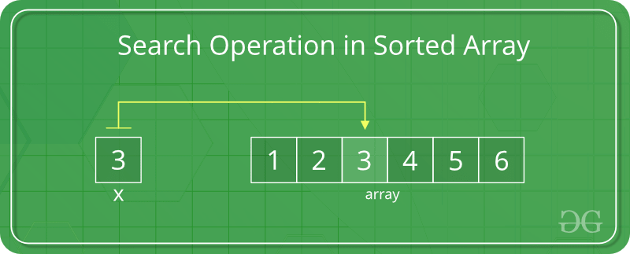
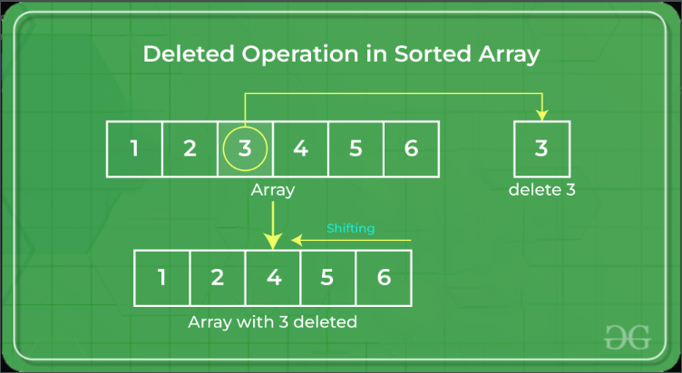

# [Array Data Structure](https://www.geeksforgeeks.org/array-data-structure/)

## What is an array : Part 1
- Collection of items stored in contiguous memory locations
- The idea
  - Store multiple items of the same data type together 
  - Makes it easier to calculate the position of each element by just adding an offset to the base value
    - Example : The memory location of the first element of the array 


](../../Screenshots/Array-data-structure.png)

## What is an array : [Part 2](https://www.geeksforgeeks.org/what-is-array/)

### Is the array always a fixed size?
- Pretty much, it can't be changed
- Since memory is statically allocated for it
  - Only the compiler can destory it

<br>

# [Introduction to Arrays – Data Structure and Algorithm Tutorials](https://www.geeksforgeeks.org/introduction-to-arrays-data-structure-and-algorithm-tutorials/)

## Basic terminologies of an Array
- Index : How the elements are identified as 
  - Index starts at 0
- Element : Items stored in an array 
  - Can be access by their index 
- Length
  - Determined by the number of elements it contains 

## Representation of an Array


](../../Screenshots/array.png)


](../../Screenshots/Arraydeclaration-660x168.png)
### This declaration is considered static or compile-time memory allocation
- Long story short : the array element's memory is allocated when a program is compiled

## Can you make a dynamic array?
- Short answer : [Yes](https://www.geeksforgeeks.org/how-do-dynamic-arrays-work/)
- Though [dynamic memory allocation](https://www.geeksforgeeks.org/what-is-dynamic-memory-allocation/) 

## Example of dynamic memory allocation

```cpp
// First example
int *array = new int[5];

// Second example
#include <iostream>

int main() {
    int size;
    
    // Prompt the user to enter the size of the array
    std::cout << "Enter the size of the array: ";
    std::cin >> size;
    
    // Dynamically allocate memory for the array
    int* arr = new int[size];
    
    // Fill the array with values
    for (int i = 0; i < size; ++i) {
        arr[i] = i * 10;
    }
    
    // Display the values in the array
    std::cout << "Values in the array:" << std::endl;
    for (int i = 0; i < size; ++i) {
        std::cout << arr[i] << " ";
    }
    std::cout << std::endl;
    
    // Deallocate the dynamically allocated memory
    delete[] arr;
    
    return 0;
}


```

## Three-dimensional array
- Can also be considered an array of two-dimensional arrays

](../../Screenshots/3D-array.png)
## Type of array operations
- Traversal --> Moving through the elements in the array
- Insertion --> Adding a new element in an array
- Deletion  --> Deleting an element from the array
- Searching --> Searching for an element in the array
- Sorting   --> Keeping the order of elements in the array 

## Advantages of using Arrays
- Memory-efficeient in storing data
  - Due to data storage in contguous memory locations
- Random accessing elements is allowed 
  - Makes accessing element positions faster
- They have better cache locality 
  - Makes big difference in performance 
- Arrays
  - Represent multiple data items of the same type using single name
  - Store multiple data of similar types with the same name
- Array D.S used to implement other D.S like  
  - Linked lists
  - Stacks 
  - Queues
  - Trees
  - Graphs

## Disadvantages of Arrays
- They have fixed size
  - Can't be increased/decreased 
  - Array of fixed size --> static array
- Allocating less memory than required could result in losing data
- Arrays are homogenous in nature
  - Can't store values of different data types
- Arrays stored in contguous memory locations
  - Makes deletion and insertion difficult to implement
  - To resolve this, Linked lists are used

## Application of arrays
- Used in look up tables
- Different sorting algorithms
  - Bubble sort
  - Insertion sort
  - Merge sort
  - Quick sort

<br>

# [Subarrays, Subsequences, and Subsets in Array](https://www.geeksforgeeks.org/array-subarray-subsequence-and-subset/?ref=lbp)

## What's a subarray 
- Contguous part of an array
  - Aka : An array inside another array

## Generally speaking
- For an array of size ```n```
  - There's --> ``` n * (n+1) / 2 ``` non-empty sub arrays
- Example
  - We have an 
    - Array of ```[1, 2, 3, 4] ```
    - There's 10 non-empty sub-arrays that are as followed
      - ``` (1), (2), (3), (4), (1,2), (2,3), (3,4), (1,2,3), (2,3,4), and (1,2,3,4)```
        


## Subsequence
- A sequence that's derivable from another sequence 
  - Done by removing 
    - Zeros 
    - Elements 
  - Doing so doesn't change the order of the remaining elements
  - Generally speaking
    - If we have a sequence of size ```n```
    - We can have ```(2^n -1)``` non empty sub-sequences in total 
  - Example : There's 15 sub-sequences and they are:
    - ``` (1),(2),(3),(4),(1,2),(1,3),(1,4),(2,3),(2,4),(3,4),(1,2,3),(1,2,4),(1,3,4),(2,3,4),(1,2,3,4). ```
    
      


## Subset
- If a ``` set ``` has it's element belonging to ``` another set ```
  - It's known to be a ``` subset ``` of the other set
- Denoted as ``` ⊆ ```
  - If ``` A ``` is a subset of ``` B ``` 
    - It's represented as ``` A ⊆ B ```
- Example
  - Set_A = {m, n, o, p, q}, Set_ B = {k, l, m, n, o, p, q, r}
  - So then ``` A ⊆ B ``` 
  
  

<br>

# [Array | Searching](https://www.geeksforgeeks.org/array-data-structure/array-searching/?ref=lbp)

## Most commonly used searching algorithms
- Linear Search
- Binary Search
- Ternary Search

## Linear Search
- Defined as
  - Sequential search algorithm
  - Starts at one end --> Goes through each element in list until desired element or group of elements is found
    - It will keep going until then
  - Time complexity : ```O(N)```
    - N = lenght of array

## Binary Search
- Array must be ```sorted``` first 
- Faster than ```Ternary search```
- Elements found by 
  - Repeatedly dividing the search interval in half 
  - Deciding the next interval to find the element
  - Time complexity : ```O(log2N)```
    - N = lenght of array
  - One thing to note
    - Array ``` must be sorted ``` in increasing/decreasing order
```cpp
// Binary Search Example
// Youtube reference : https://www.youtube.com/watch?v=fDKIpRe8GW4
#include <iostream>

// Binary search function
int binarySearch(int arr[], int size, int target) {
    int left = 0;
    // Point to last element in array
    int right = size - 1;
    
    while (left <= right) 
    {
        // Find the 'middle'
        int mid = left + (right - left) / 2;
        
        // Check if target is present at mid
        if (arr[mid] == target) {
            return mid;
        }
        
        // If target is greater, ignore left half
        if (arr[mid] < target) {
            left = mid + 1;
        }
        // If target is smaller, ignore right half
        else {
            right = mid - 1;
        }
    }
    
    // If element is not present, return -1
    return -1;
}

// Main function
int main() {
    int arr[] = {2, 3, 4, 10, 40};
    int size = sizeof(arr) / sizeof(arr[0]);
    int target = 10;
    
    int result = binarySearch(arr, size, target);
    
    if (result == -1) {
        std::cout << "Element not present in array" << std::endl;
    } else {
        std::cout << "Element found at index " << result << std::endl;
   


```
## Ternary Search
- Divide and conquer algorithm
- Similar to binary search where we ``` divide the array into two parts ```
  - But we divide it into ``` three parts ``` 
  - Then determine which has the ``` key/searched element ```
- This algorithm ``` must be sorted ```
- Time complexity : ``` O(log3N) ```
  - N = lenght of array

```cpp
// Ternary Search Example

#include <iostream>

// Ternary search function
int ternarySearch(int arr[], int left, int right, int target) {
    if (right >= left) {
        int mid1 = left + (right - left) / 3;
        int mid2 = mid1 + (right - left) / 3;

        // Check if target is present at mid1 or mid2
        if (arr[mid1] == target) {
            return mid1;
        }
        if (arr[mid2] == target) {
            return mid2;
        }

        // If target is smaller than mid1, search the left segment
        if (target < arr[mid1]) {
            return ternarySearch(arr, left, mid1 - 1, target);
        }
        // If target is greater than mid2, search the right segment
        else if (target > arr[mid2]) {
            return ternarySearch(arr, mid2 + 1, right, target);
        }
        // If target is between mid1 and mid2, search the middle segment
        else {
            return ternarySearch(arr, mid1 + 1, mid2 - 1, target);
        }
    }
    
    // If element is not present, return -1
    return -1;
}

// Main function
int main() {
    int arr[] = {1, 2, 3, 4, 5, 6, 7, 8, 9, 10};
    int size = sizeof(arr) / sizeof(arr[0]);
    int target = 6;

    int result = ternarySearch(arr, 0, size - 1, target);

    if (result == -1) {
        std::cout << "Element not present in array" << std::endl;
    } else {
        std::cout << "Element found at index " << result << std::endl;
    }

    return 0;
}


```


```

         |
      O(n^2)         O(n^2) actual direction 
         |            /
         |           /
         |          /
         |         /
         |        /
         |       /
         |      /
         |     /
         |    /
         |   /
         |  /
         | /           O(n) actual direction -->
    O(n) |------------------ 
         |                     \
         |                      \
         |                       \
         |                        \
         |                         \
         |                          \
         |                           \
         |                            \
         |                             \
         |                              \
         |                               \
         |                                \
         |                               O(log n) actual direction
         |
         |
         |
         |
         |
         |
         |
         |
         |
         |
         |
    O(log n)  -------------------------

```

---
<br>

# [Search, Insert, and Delete in an Unsorted Array | Array Operations](https://www.geeksforgeeks.org/search-insert-and-delete-in-an-unsorted-array/?ref=lbp)

## Search Operation
- In an ```unsorted array``` 
  - Search operations can be performed by ```linear traversal``` from the first --> last
- Time complexity : O(N)

```cpp
// C++ program to implement linear
// search in unsorted array
#include <bits/stdc++.h>
using namespace std;

// Function to implement search operation
int findElement(int arr[], int n, int key)
{
	int i;
	for (i = 0; i < n; i++)
		if (arr[i] == key)
			return i;
	
	// If the key is not found
	return -1;
}

// Driver's Code
int main()
{
	int arr[] = { 12, 34, 10, 6, 40 };
	int n = sizeof(arr) / sizeof(arr[0]);

	// Using a last element as search element
	int key = 40;

	// Function call
	int position = findElement(arr, n, key);

	if (position == -1)
		cout << "Element not found";
	else
		cout << "Element Found at Position: "
			<< position + 1;

	return 0;
}

// This code is contributed
// by Akanksha Rai

```

## Insert Operations (At the end)
- In an ```unsorted array``` 
  - Insertion faster when compared to ```sorted array```
  - Due to not having to worry about the  position which the element is to be placed
- Time complexity : O(1)

    

```cpp
#include <iostream>
using namespace std;

// Inserts a key in arr[] of given capacity.
// n is the current size of arr[]. This
// function returns n + 1 if insertion
// is successful, else n.
int insertSorted(int arr[], int n, int key, int capacity)
{
	// Cannot insert more elements if n is
	// already more than or equal to capacity
	if (n >= capacity)
		return n;

	arr[n] = key;
	return (n + 1);
}

int main()
{
  // Has space for 20 values 
	int arr[20] = { 12, 16, 20, 40, 50, 70 };
  // capacity = 6 currently
	int capacity = sizeof(arr) / sizeof(arr[0]);
	int n = 6;
	int i, key = 26;

	cout << "Before Insertion: ";
	for (i = 0; i < n; i++)
		cout << arr[i] << " ";

	// Inserting key since 'n' is already at the end of the list
	n = insertSorted(arr, n, key, capacity);

	cout << "\nAfter Insertion: ";
	for (i = 0; i < n; i++)
		cout << arr[i] << " ";

	return 0;

  //Before Insertion: 12 16 20 40 50 70 
  //After Insertion: 12 16 20 40 50 70 26 
}

```

## Insert at any position
- Is done by shifting elements ```to the right``` of the required position


```cpp
// C++ Program to Insert an element
// at a specific position in an Array

#include <bits/stdc++.h>
using namespace std;

// Function to insert element
// at a specific position
void insertElement(int arr[], int sizeOfArray, int valueToBeInserted, int pos)
{
	// Iterates from the end of the array to the actual position 
	for (int i = sizeOfArray - 1; i >= pos; i--)
    // Does the shifting towards the right
    // Copies the value of the elements at 'i' to the position next to it
		arr[i + 1] = arr[i];

	arr[pos] = valueToBeInserted;
}

// Driver's code
int main()
{
	int arr[15] = { 2, 4, 1, 8, 5 };
  int sizeOfArray = sizeof(arr) / sizeof(arr[0]);

	cout<<"Before insertion : ";
	for (int i = 0; i < sizeOfArray; i++)
		cout<<arr[i]<<" ";

	cout<<endl;

	int valueToBeInserted = 10, pos = 2;

	// Function call
	insertElement(arr, sizeOfArray, valueToBeInserted, pos);
  
  // Needed to reflect the actual size of the array after the insertion of the new element
  sizeOfArray++;

	cout<<"After insertion : ";
	for (int i = 0; i < sizeOfArray; i++)
		cout<<arr[i]<<" ";

	return 0;
  //Before insertion : 2 4 1 8 5 
  //After insertion  : 2 4 10 1 8 5 
}

```

## Delete operations
- The element to be deleted is searched by using ```linear search```
- Deletion operation performed followed by shifting the elements
- Time complexity : 0(1)


```cpp
// C++ program to implement delete operation in a
// unsorted array
#include <iostream>
using namespace std;

// To search a key to be deleted
int findElement(int arr[], int arraySize, int key);

// Function to delete an element
int deleteElement(int arr[], int arraySize, int key)
{
	// Find position of element to be deleted
	int pos = findElement(arr, arraySize, key);

	if (pos == -1) {
		cout << "Element not found";
		return arraySize;
	}

	// Deleting element
	for (int i = pos; i < arraySize - 1; i++)
		arr[i] = arr[i + 1];

	return arraySize - 1;
}

// Function to implement search operation
// Straight up linear search
int findElement(int arr[], int arraySize, int key)
{
	for (int i; = 0; i < arraySize; i++)
		if (arr[i] == key)
			return i;

	return -1;
}

// Driver's code
int main()
{
	int i;
	int arr[] = { 10, 50, 30, 40, 20 };

	int arraySize = sizeof(arr) / sizeof(arr[0]);
	int key = 30;

	cout << "Array before deletion\n";
	for (i = 0; i < arraySize; i++)
		cout << arr[i] << " ";
	

	// Function call
	arraySize = deleteElement(arr, arraySize, key);

	cout << "\n\nArray after deletion\n";
	for (i = 0; i < arraySize; i++)
		cout << arr[i] << " ";

	return 0;
}

// This code is contributed by shubhamsingh10
```
<br>

---

<br>

# [Search, Insert, and Delete in an SORTED ARRAY | Array Operations](https://www.geeksforgeeks.org/search-insert-and-delete-in-a-sorted-array/?ref=lbp)



## Searching Sorted Array
- Search operation perfromed by using [binary search](https://www.geeksforgeeks.org/binary-search)

```cpp
// Binary Search Example
// Youtube reference : https://www.youtube.com/watch?v=fDKIpRe8GW4
#include <iostream>

// Binary search function
int binarySearch(int arr[], int size, int target) {
    int left = 0;
    // Point to last element in array
    int right = size - 1;
    
    while (left <= right) 
    {
        // Find the 'middle'
        int mid = left + (right - left) / 2;
        
        // Check if target is present at mid
        if (arr[mid] == target) {
            return mid;
        }
        
        // If target is greater, ignore left half
        if (arr[mid] < target) {
            left = mid + 1;
        }
        // If target is smaller, ignore right half
        else {
            right = mid - 1;
        }
    }
    
    // If element is not present, return -1
    return -1;
}

// Main function
int main() {
    int arr[] = {2, 3, 4, 10, 40};
    int size = sizeof(arr) / sizeof(arr[0]);
    int target = 10;
    
    int result = binarySearch(arr, size, target);
    
    if (result == -1) {
        std::cout << "Element not present in array" << std::endl;
    } else {
        std::cout << "Element found at index " << result << std::endl;
```

## [Binary search in more detail](https://www.geeksforgeeks.org/binary-search/)

### Complexity Analysis of Binary Search
#### Time complexity
  - Best case --> 0(1)
  - Average Case --> 0(log N)
  - Worst Case --> 0(log N)
#### Advantages of binary search
  - Much faster than ```linear search```
    - Especially for larger arrays
  - More efficient than other search algorithms with similar time complexities  
    - Algorithms like ```interpolation or exponential search ```
#### Drawbacks of binary search
  - Array needs to be sorted
  - Data being searched needs to be stored in contguous memory locations 
  - Elements of the array need to be comparable
    - Aka, they need to be ordered
#### Applications of Binary search
- Can be used as building block for more complex algorithms used in ML
  - Training neural networks
  - Finding optimal hyperparameters for a model
- Searching a database


## Inserting into a sorted array
- Serach operations performed by conducting 
  - A binary search
  - The actual insertion operation
    - Shifting the elements
- In an ```unsorted array``` insertion is much faster since we don't care about the position where the element is placed


```cpp
// C++ program to implement insert operation in 
// an sorted array. 
#include <bits/stdc++.h> 
using namespace std; 

// Inserts a key in arr[] of given capacity. n is current 
// size of arr[]. This function returns n+1 if insertion 
// is successful, else n. 
int insertSorted(int arr[], int n, int key, int capacity) 
{ 
	// Cannot insert more elements if n is already 
	// more than or equal to capacity 
	if (n >= capacity) 
		return n; 

	int i; 
  /*
    Start at the end of the array
    Moves from right to left until it finds an element smaller than the key
  */
	for (i = n - 1; (i >= 0 && arr[i] > key); i--) 
    // Moves one position to the right
		arr[i + 1] = arr[i]; 

  // Ensures the key is placed to the RIGHT 
	arr[i + 1] = key; 

	return (n + 1); 
} 

/* Driver code */
int main() 
{ 
	int arr[20] = { 12, 16, 20, 40, 50, 70 }; 
	int capacity = sizeof(arr) / sizeof(arr[0]); 
	int n = 6; 
	int i, key = 26; 

	cout << "\nBefore Insertion: "; 
	for (i = 0; i < n; i++) 
		cout << arr[i] << " "; 

	// Function call 
	n = insertSorted(arr, n, key, capacity); 

	cout << "\nAfter Insertion: "; 
	for (i = 0; i < n; i++) 
		cout << arr[i] << " "; 

	return 0; 
} 

// This code is contributed by SHUBHAMSINGH10

```

## Delete in a sorted array



```cpp
// C++ program to implement delete operation in a 
// sorted array 
#include <bits/stdc++.h> 
using namespace std; 

// To search a key to be deleted 
int binarySearch(int arr[], int low, int high, int key); 

/* Function to delete an element */
int deleteElement(int arr[], int n, int key) 
{ 
	// Use binary search to look for the element to be deleted
	int pos = binarySearch(arr, 0, n - 1, key); 

	if (pos == -1) 
  { 
		cout << "Element not found"; 
		return n; 
	} 

	// Deleting element 
  // For loop starts at the end of the array
  // Then iterates to the left 
	int i; 
	for (i = pos; i < n - 1; i++) 
    // Copies the element at 'i+1' to index 'i'
    // Pretty much shifts everything to the left
		arr[i] = arr[i + 1]; 

	return n - 1; 
} 

int binarySearch(int arr[], int low, int high, int key) 
{ 
	if (high < low) 
		return -1; 
	int mid = (low + high) / 2; 
	if (key == arr[mid]) 
		return mid; 
	if (key > arr[mid]) 
		return binarySearch(arr, (mid + 1), high, key); 
	return binarySearch(arr, low, (mid - 1), key); 
} 

// Driver code 
int main() 
{ 
	int i; 
	int arr[] = { 10, 20, 30, 40, 50 }; 

	int n = sizeof(arr) / sizeof(arr[0]); 
	int key = 30; 

	cout << "Array before deletion\n"; 
	for (i = 0; i < n; i++) 
		cout << arr[i] << " "; 

	// Function call 
	n = deleteElement(arr, n, key); 

	cout << "\n\nArray after deletion\n"; 
	for (i = 0; i < n; i++) 
		cout << arr[i] << " "; 
} 

// This code is contributed by shubhamsingh10

```