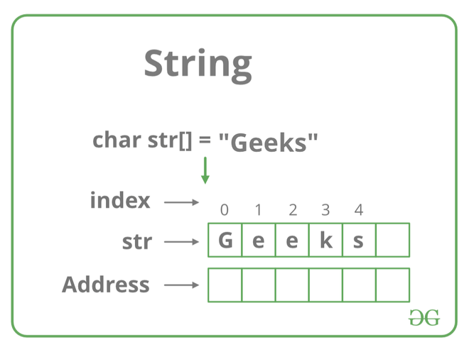

# [String Data Structures](https://www.geeksforgeeks.org/string-data-structure/?ref=shm#what-is-a-string)

## What exactly is a string
- A sequence of characters used to represent text
  - Represented as an array of bytes/words that store a sequence of chracters
- Commonly used to store/manipulate textual data 
  - Can be manipulated using various operations like
    - Concatenation 
    - Substring extraction
    - Comparison 
- Difference between `character array` and a `string`
  - `Strings` are terminated by special character `\0`

## String data type
- Treated as a `distinct data type`
  - Meaning they have their own set of operations/properties 
  - They can be declared/manipulated using specific string-related functions/methods 

## String operations
- The following operations let developers manipulate/process string data efficiently
- Concatenation: 
  - Combining two strings to create a new string.
- Length: 
  - Determining the number of characters in a string.
- Access: 
  - Accessing individual characters in a string by index.
- Substring: 
  - Extracting a portion of a string.
- Comparison: 
  - Comparing two strings to check for equality or order.
- Search: 
  - Finding the position of a specific substring within a string.
- Modification: 
  - Changing or replacing characters within a string.

## Application of String
- Text processing
  - Use extensively for text processing tasks such as
    - Searching
    - Manipulating
    - Analyzing text data
- Data representation
  - Strings are fundamental for representing/manipulating data in formats like `JSON`, `XML` and `CSV`
- Encryption/Hashing
  - Strings commonly used in encryption/hashing algorithms to 
    - Secure sensitive data
    - Ensure data integrity 
- Database Opeartions 
  - Strings are esential when working with DB, to include storing/querying text-based data
   
# Basics of Strings

## [How are strings represented in memory](https://www.geeksforgeeks.org/introduction-to-strings-data-structure-and-algorithm-tutorials/)
- Strings ca be referred to as either
  - Using a character pointer
  - Character array
    - When declared as such, they're stored like other types of arrays in C
    - Example : if str[] is a `auto variable` then the string is stored in the `stack segment`
    - If it's a `global/static variable` then the data is stored in the data segment

        

## General operations performed on String

### Concatenation of Strings
- Aka : combining more than one string together 
- Using [built in methods](https://www.geeksforgeeks.org/string-concatenation-in-cpp/)
  - 6 methods
    - `append()`
    - The `+` operator
    - `strcat()` function
    - Using a for loop
    - Using inheritance
    - Using `Friend Function` and `strcat()` function

### The `append()` function
- Member function of the std::string class
- Can concatenate two C++ style strings as shown in the example below

```cpp
// C++ Program for string
// concatenation using append
#include <iostream>
using namespace std;

// Driver code
int main()
{
	string init("this is init");
	string add(" added now");

	// Appending the string.
	init.append(add);

	cout << init << endl; // Output : this is init added now

	return 0;
}

```

### The `+` operator
- Easiest method to concatenate two strings 
- Only works with C++ style strings 
``` cpp
// C++ Program for string
// concatenation using '+' operator
#include <iostream>
using namespace std;

// Driver code
int main()
{
	string init("this is init");
	string add(" added now");

	// Appending the string.
	init = init + add;

	cout << init << endl;
	return 0;
}
```