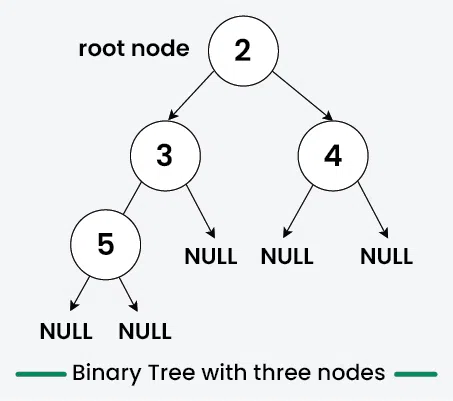

# [Binary Tree Data Structure](https://www.geeksforgeeks.org/binary-tree-data-structure/)
## What is it
- Hierarchical data structure
- Each node has **at most** two children
  - Commonly referred to as the `left` and `right` child 
- Commonly used for `efficient storage` and `retrieval of data` 
  - Along side various operations like
    - Insertion
    - Deletion
    - Traversal

# [Introduction](https://www.geeksforgeeks.org/introduction-to-binary-tree/)
## Binary Trees are 
- Non-linear 
- A hierarchical data structure that has at most `two children `
  - Commonly referred to as the `left` and `right` child 
- Top most binary tree is called `the root`
- Bottom most binary tree is called `the leaves` 


# Representation of a Binary Tree
- Each node has three parts
  - Data 
  - Pointer to the left child
  - Pointer to the right child


## Create/Declare a Node of a Binary Tree

```cpp
// Use any below method to implement Nodes of binary tree

// 1: Using struct
struct Node {
    int data;
    Node* left, * right;

    Node(int key) {
        data = key;
        left = nullptr;
        right = nullptr;
    }
};

// 2: Using class

// Node* is a self-referential class since it has pointers to other objects of the same type (Node)
// This is needed for DS list tree structures, linked lists and other recursive data structures
class Node {
public:
    int data;
    Node* left, * right;

    Node(int key) {
        data = key;
        left = nullptr;
        right = nullptr;
    }
};
```

## Example of Creating a Binary Tree



```cpp
#include <iostream>
using namespace std;

struct Node{
    int data;
    Node *left, *right;
    Node(int d){
        data = d;
        left = nullptr;
        right = nullptr;
    }
};

int main(){
    // Initilize and allocate memory for tree nodes
    Node* firstNode = new Node(2); // Parent node of 2 and 3
    Node* secondNode = new Node(3); // Parent node of 5
    Node* thirdNode = new Node(4); // No kids 
    Node* fourthNode = new Node(5); // Child of 3 and is still considered a leaf node since it doesn't have kids

    // Connect binary tree nodes
    firstNode->left = secondNode;   // 3
    firstNode->right = thirdNode;   // 4
    secondNode->left = fourthNode;  // 5
    return 0;
}
```

## In the code above 
- `Four tree nodes` were created and have connected those node to form the tree structure as mentioned in the above image 
  - `firstNode` that has the value `2`
  - `secondNode` that has the value `3`
    - Connected to the left of `firstNode` by `firstNode->left = secondNode`
  - `thirdNode` that has the value `4`
    - Connected to the `right` of `firstNode` by `firstNode->right = thirdNode`
  - `fourthNode` that has the value `5`
    - Connected to the left of `secondNode` by `secondNode->left = fourthNode`


## Binary Tree Terminology

| **Terminology** | **Definition** |
| --- | --- |
| Node | A fundamental part of a binary tree, containing data and links to two child nodes. |
| Root | The topmost node in a tree, with no parent and serving as the starting point for all nodes. |
| Parent Node | A node with one or more child nodes, having at most two children per node. |
| Child Node | A descendant of another node (its parent), having zero or more parents. |
| Leaf Node | A node without any children or both children being null. |
| Internal Node | A node with at least one child, excluding the root and leaf nodes. |
| Depth of a Node | The number of edges from a specific node to the root node, starting from zero. |
| Height of a Binary Tree | The number of nodes from the deepest leaf node to the root node, indicating the maximum depth of the tree. |

### Below shows all the terms in a Binary Tree


## Properties of a Binary Tree
- Max number of nodes at level `L` of a binary tree : 2<sup>L</sup>
- Max number of nodes in a binary tree of `HEIGHT`  : 2<sup>L</sup> - 1
- Total number of leaf nodes = Total number of nodes with 2 children + 1
  - Leaf nodes : Nodes that 
    - Don't have children
    - Or both children are full
- In a Binary Tree with N nodes 
  - Minimum possible height or the minimum number of levels is : Log<sub>2</sub>(N+1)
- A binary tree with `L` leaves 
  - Has at least : `| Log2L | + 1` levels 

## Types of Binary Tree(s)
### Based on the number of children
- Full  
- Degenerate  
- Skewed
### Based on the completion of levels
- Complete
- Perfect
- Balance 
### Based on the node values 
- Binary Search 
- AVL
- Red Black
- B 
- B+ 
- Segment 

## [Operations on a Binary Tree](https://www.geeksforgeeks.org/introduction-to-binary-tree/)
### Traversal in a Binary Tree
- Involves visiting `ALL the nodes` of the binary tree
- Tree traversal algorithms are classified broadly into two categories 
  - Depth-First Search (DFS)
  - Breadth-First Search (BFS)
---

### Depth-First Search 
- Explores far down a branch as possible `before backtracking`
- Implemented using `recursion`
- Main traversal methods in DFS are:
  - `Preorder Traversal `
    - Current-left-right
      - Visits node first 
      - Then left subtree
      - Then right subtree
  - `Inorder Traversal `
    - Left-current-right
      - Visits left subtree
      - Then node
      - Then right subtree
  - `Postorder Traversal`
    - Left-right-current
      - Visits left subtree
      - Then right subtree
      - Then the node

# Pre-Order Traversal Algorithm
### Node.Left.Right Approach (Root → Left → Right)

Here's how the pre-order traversal algorithm works:
```bash
      2         # Root node
     / \
    3   4       # 3 is the left child 2 is the right child
   /
  5             # 5 is the LEFT CHILD of 3
```
## Steps

1. **Visit the root first**: Begin by visiting the `root` node of the binary tree.
    *   The root node is `2`.

2.  **Move to the left subtree**: Next, move to its left child.

3.  **Move further left (if necessary)**: If the left child has left children, move down one level and visit those nodes first.

4.  **Go back up and move to the right subtree**: Once all left descendants of a node have been visited, backtrack up the tree until you reach the previous parent node (the one whose left child you just visited), then proceed to its right subtree.

## Pre-Order Output

The pre-order traversal algorithm visits nodes in this order: `Node → Left subtree → Right subtree`.

For our binary tree:
```bash
      2
     / \
    3   4
   /
  5
```

*   Root Node: `2`
    *   Left Child of `2`: --> `3`
        *   Left Child of `3`: --> `5`
    *   Right Child of `2`: --> `4`

The pre-order traversal output is: `2 3 5 4`.

### Step-by-Step Pre-Order Traversal

Here's the step-by-step process:
For our binary tree:
```bash
      2
     / \
    3   4
   /
  5
```
1.  **Visit 2 (root)**
2.  **Move left → Visit 3**
    *   Move left again to visit `5` (since `3` has a left child)
3.  **No more left nodes, move back up to 2 and go right → Visit 4**

### Program for Preorder Traversal of a Binary Tree

```cpp
// C++ program for preorder traversals

#include <bits/stdc++.h>
using namespace std;

// Structure of a Binary Tree Node
class Node
{
public:
    int data;
    class Node *left, *right;
    Node(int v) // Constructor
    {
        data = v;
        left = right = nullptr;
    }
    // Function to print preorder traversal
    void printPreorder(Node *node)
    {
        if (node == nullptr)
            return;

        // Deal with the node
        cout << node->data << " ";

        // Use recursion on left sub-tree
        printPreorder(node->left);

        // Use recursion on right sub-tree
        printPreorder(node->right);
    }
};

// Driver code
int main()
{
    Node *root = new Node(1);   // Due to constructor, any value passed to Node() will be assigned
    root->left = new Node(2);
    root->right = new Node(3);
    root->left->left = new Node(4);
    root->left->right = new Node(5);
    root->right->right = new Node(6);

    // Function call
    cout << "Preorder traversal of binary tree is: \n";
    root->printPreorder(root);

    return 0;
}

```


---

# Inorder Traversal Example : Left → Node → Right Approach
Take the following binary tree
```bash
      2
     / \
    3   4
   /
  5
```

#### Here's how the in-order traversal algorithm works:

1.  **Start at the root**: Begin by visiting the root node of the binary tree.
    *   The root node is `2`.

2.  **Move to the left subtree**: Before visiting the root, move to its left child.

3.  **Visit the leftmost node**: If there's a left child, move down one level and visit that node first.

4.  **Backtracking**: After visiting the leftmost node, backtrack up the tree until you reach the previous parent node (the one whose left child you just visited).

5.  **Visit the current node**: Then, move back to the current parent node (which is now at a lower level) and visit it.

6.  **Repeat steps 3-5 for all children**: Continue this process until all nodes in the tree have been visited.

#### Here's how this applies to our specific binary tree:
```bash
      2
     / \
    3   4
   /
  5
```

1.  Start at the root node `2`.
    *   Move to its left child, which is `3`.

2.  Visit `3`'s left child, which is `5`.
    *   Since `5` has no left child, print `5`.
    *   Backtrack up to `3`.
    *   Print `3`.

3.  Now backtrack up to the root node `2`.
4.  Move to the right subtree of the root node.
    *   Visit the right child of `2`, which is `4`.
    *   Since `4` has no left child, print `4`.


### C++ program for `Inorder Traversal`

```cpp
// C++ program for inorder traversals

#include <bits/stdc++.h>
using namespace std;

// Structure of a Binary Tree Node
class Node {
public:
    int data;
    struct Node *left, *right;
    Node(int v)
    {
        data = v;
        left = right = nullptr;
    }
};

// Function to print inorder traversal
void printInorder(struct Node* node)
{
    if (node == nullptr)
        return;

    // Depending on the ordering of the following lines of code will dictate what type of traversal is to happen

    // First recur on left subtree and keeps iterating until it hits a 'nullptr'
    printInorder(node->left);

    // Now print out the value of the node after hitting the nullptr
    cout << node->data << " ";

    // Then recur on right subtree
    printInorder(node->right);
}

// Driver code
int main()
{
    Node* root = new Node(1);
    root->left = new Node(2);
    root->right = new Node(3);
    root->left->left = new Node(4);
    root->left->right = new Node(5);
    root->right->right = new Node(6);

    // Function call
    cout << "Inorder traversal of binary tree is: \n";
    printInorder(root);
    /*
    Left → Node → Right Approach
               1
           /      \
        2           3
      /   \      /   \  
    4       5   5       6       
    */
    // Inorder traversal of binary tree is: 4 2 5 1 3 6 
    return 0;
}


```
---

# Post-Order Traversal Algorithm
### L.R.N Approach (Left → Right → Node)

Here's how the post-order traversal algorithm works:

## Steps
```bash
      2
     / \
    3   4
   /
  5
```
1.  **Go to the left subtree first**: Begin by visiting the leftmost nodes of all child subtrees.
    *   The `left subtree` is `3`.
2.  **Move further left (if necessary)**: If the current node has a left child, move down one level and visit that child first.

3.  **Visit the current node (after its left children are visited)**: Once all left descendants of a node have been visited, backtrack up the tree until you reach the previous parent node (the one whose left child you just visited), then proceed to its right subtree.

4.  **Finally, visit the root**: After all leaf nodes and their descendants have been visited, move back up the tree and visit the
current node (in this case, the root).

## Post-Order Output

The post-order traversal algorithm visits nodes in this order: `Left → Right → Node`.

For our binary tree:
```bash
      2
     / \
    3   4
   /
  5
```

*   Root Node: `2`
    *   Left Child of `2`: `3`
        *   Left Child of `3`: `5`
    *   Right Child of `2`: `4`

The post-order traversal output is: `5 3 4 2`.

### Step-by-Step Post-Order Traversal

Here's the step-by-step process:
```bash
      2
     / \
    3   4
   /
  5
```
1.  **Move left → Move left again → Visit 5** (no children)
    *   Since there are no more left nodes, move back up to `3`.
2.  **Go back up to 3 → Visit 3**
    *   Now that all left descendants of `3` have been visited, proceed to its right child.
3.  **Move back up to 2 → Move right → Visit 4** (since `3` has no more children)
4.  **Visit 2 (root last)**


--- 

# Breadth-First Search
- Explores all nodes at the present level before moving on to nodes `at the next depth level`
- Typically implemented using a `queue`
- BFS commonly reffered to as `Level Order Traversal`

#### Example of traversal algorithm found below 

```cpp
#include <bits/stdc++.h>
using namespace std;

struct Node {
    int data;
    Node* left, * right;

    Node(int d) {
        data = d;
        left = nullptr;
        right = nullptr;
    }
};

// In-order DFS: Left, Root, Right
void inOrderDFS(Node* node) {
    if (node == nullptr) return;

    inOrderDFS(node->left);
    cout << node->data << " ";
    inOrderDFS(node->right);
}

// Pre-order DFS: Root, Left, Right
void preOrderDFS(Node* node) {
    if (node == nullptr) return;

    cout << node->data << " ";
    preOrderDFS(node->left);
    preOrderDFS(node->right);
}

// Post-order DFS: Left, Right, Root
void postOrderDFS(Node* node) {
    if (node == nullptr) return;

    postOrderDFS(node->left);
    postOrderDFS(node->right);
    cout << node->data << " ";
}

void BFS(Node* root) {

    if (root == nullptr) return;
    queue<Node*> q;             // queue of Node* pointers, looks like a vector but isn't and is used for FIFO applications
                                // Both queue and vectors are template containers in the STL tho
    q.push(root);
    
    //Queue stuff here
    while (!q.empty()) {
        Node* node = q.front(); // Get the first/oldest node from the queue that we're going to process
        q.pop();                // Removes the front node from the queue since we're done processing it to abide by the FIFO behavior
        cout << node->data << " ";

        // If the perspective 'child' exist, push it into the queue 'q'
        if (node->left != nullptr) q.push(node->left);
        if (node->right != nullptr) q.push(node->right);
        
    }
}

int main() {
    Node* root = new Node(2);
    root->left = new Node(3);
    root->right = new Node(4);
    root->left->left = new Node(5);

    cout << "In-order DFS: ";
    inOrderDFS(root);

    cout << "\nPre-order DFS: ";
    preOrderDFS(root);
   
    cout << "\nPost-order DFS: ";
    postOrderDFS(root);
  
    cout << "\nLevel order: ";
    BFS(root);

    return 0;
}
```


### Implementation of BFS
```cpp
#include <iostream>
#include <queue>
using namespace std;

// Class definition for a Node
class Node {
public:
    int data;
    Node *left, *right;

    Node(int value) {
        data = value;
        left = right = nullptr;
    }
};

// Function to perform Breadth-First Search (BFS) / Level Order Traversal
void bfs(Node* root) {
    if (root == nullptr)
        return;

    queue<Node*> q; // Queue to hold nodes for processing
    q.push(root);

    while (!q.empty()) {
        Node* current = q.front();
        q.pop();

        // Print the current node
        cout << current->data << " ";

        // Enqueue the left child
        if (current->left)
            q.push(current->left);

        // Enqueue the right child
        if (current->right)
            q.push(current->right);
    }
}

// Driver function
int main() {
    Node* root = new Node(1);
    root->left = new Node(2);
    root->right = new Node(3);
    root->left->left = new Node(4);
    root->left->right = new Node(5);
    root->right->right = new Node(6);

    cout << "BFS (Level Order Traversal) of the binary tree: ";
    bfs(root);
    cout << endl;

    return 0;
}
```
---

## Insertion in Binary Tree
- How to add new nodes into binary tree
- FYI, there is no ordering of nodes in a binary tree

### First step
- Create a `root node` for an empty tree
- The following insertuions would iteratively search for an `empty place` at each level of the tree 
  - When an empty `left` or `right` child is found 
  - A new node is inserted there 
  - By convention insertion always starts with the left child node


### Example code 
```cpp
#include <bits/stdc++.h>
using namespace std;

struct Node {
    int data;
    Node* left, * right;
    Node(int d) {
        data = d;
        left = right = nullptr;
    }
};

// Function to insert a new node in the binary tree
Node* insert(Node* root, int key) {
    // If the tree is empty, create the root node
    if (root == nullptr) {
        root = new Node(key);
        return root;
    }
    // Create a queue for level order traversal
    queue<Node*> q;
    q.push(root);

    // Do level order traversal until we find an empty place
    while (!q.empty()) {
        Node* temp = q.front();
        q.pop();

        // If left child is empty, insert the new node here
        if (temp->left == nullptr) {
            temp->left = new Node(key);
            break;
        } else {
            q.push(temp->left);
        }
        // If right child is empty, insert the new node here
        if (temp->right == nullptr) {
            temp->right = new Node(key);
            break;
        } else {
            q.push(temp->right);
        }
    }
    return root;
}

void inorder(Node* root) {
    if (root == nullptr) return;
    inorder(root->left);
    cout << root->data << " ";
    inorder(root->right);
}

int main() {
    Node* root = new Node(2);
    root->left = new Node(3);
    root->right = new Node(4) ; 
    root->left->left = new Node(5);
  
    cout << "Inorder traversal before insertion: ";
    inorder(root);
    cout << endl;

    int key = 6;
    root = insert(root, key);

    cout << "Inorder traversal after insertion: ";
    inorder(root);
    cout << endl;

    return 0;
}
/*
    Side notes on what happens with root->left->left
        - Node is dynamically allocated on the heap using new
        - While the pointers are in the stack memory

        Variable	Type	Memory Location	Points To
        root	Node*	Stack	Node(2) in Heap
        root->left	Node*	Heap (inside Node(2))	Node(3) in Heap
        root->right	Node*	Heap (inside Node(2))	Node(4) in Heap
        root->left->left	Node*	Heap (inside Node(3))	Node(5) in Heap

    What actually happens in memory when using root->left->left
        - root->left
            - Moves one level down from root
            - Following the pointer stored in left
        - root->left->left
            - Moves another level down 
        - Visualization is below

        Stack                           Heap
        ---------------------------     -----------------------
        root (0x100) -----------------> [ Node(2) | left=0x200 | right=0x300 ]  // root at 0x100
                                        | data=2                               |
                                        --------------------------------------
                                            |left  
                                            ↓   MOVE DOWN
                                    [ Node(3) | left=0x400 | right=nullptr ]  // root->left at 0x200
                                        | data=3                               |
                                        --------------------------------------
                                            |left  
                                            ↓ MOVE DOWN
                                    [ Node(5) | left=nullptr | right=nullptr ]  // root->left->left at 0x400
                                        | data=5                                 |
                                        --------------------------------------

*/
```

---

## [Breadth First Traversal (Level Order Traversal)](https://www.geeksforgeeks.org/level-order-tree-traversal/)

### What is it?
- A graph traversal algorithm that starts traversing the graph `from the root node` 
- Then explores the `neighboring nodes` at the `present depth` before moving on to the next nodes `at the next depth level`

## How does it work?
- Step 1) Starts at root node 
  - Adds it to a `queue`
- Step 2) While queue is `not empty` 
  - `dequeue a node` and visit it
- Enqueue all the children (if any) into the queue
- Repeat steps 2 and 3 until queue is empty
- This approach
  - Ensures the nodes at each level are visited 
  - Thus moving `horizontally` across the tree before moving to the next level
    - Hence the `breadth-first` manner 
    - Makes it useful for tasks like :
      - Finding the `shortest path` in unweighted graphs/trees

## How BFT is accomplished
- Using `Stacks` (Recusion)
- Using `Queue`  (Recusion)

### Using `Stacks`
- Stacks : Last In First Out (LIFO)
  - New values are placed at the bottom
  - While the 'newest' values are taken from the top
- O(n) time and O(n) space
- The big idea  
  - Traverse the tree `recursively`
    - Passing the `current node` and it's `level`
    - Starting with the `root` node at level 0
  - For each visited node
    - The node value is added to the `result` array 
    - By considering the value of  `current level` as an `index` in the `result` array 

### Example using Stacks
```cpp
// Recursive C++ program for level order traversal of Binary Tree
#include <iostream>
#include <vector>
using namespace std;

class Node {
public:
    int data;
    Node *left, *right;

    // Constructor to initialize a new node
    Node(int value) {
        data = value;
        left = nullptr;
        right = nullptr;
    }
};

// Helper function for recursive level order traversal
// Remember 'res' is being passed by reference since we need to modify the actual vectors that are stored at the level-order traversal 
void levelOrderRec(Node* root, int level, vector<vector<int>>& res) {
      // Base case: If node is null, return
    if (root == nullptr) return; 

    // Add a new level to the result if needed
    // TL;DR if a sub-vector isn't allocated for that level yet, make one
    if (res.size() <= level) 
        // The empty brackets adds an empty vector to 'res'
        res.push_back({});      
  
    // Add current node's data to its corresponding level
    res[level].push_back(root->data);

    // Recur for left and right children
    levelOrderRec(root->left, level++, res);
    levelOrderRec(root->right, level++, res);
}

// Function to perform level order traversal
vector<vector<int>> levelOrder(Node* root) {
    vector<vector<int>> res;      // Step 1: Initialize an empty 2D vector to store level-wise traversal
    levelOrderRec(root, 0, res);  // Step 2: Call the recursive function with level = 0
    return res;                   // Step 3: Return the result after recursion completes
}


int main() {
    // Create binary tree
    //      1         
    //     / \       
    //    3   2      
    //          \   
    //           4 
    //          /  \
    //         6    5
    Node* root = new Node(1);
    root->left = new Node(3);
    root->right = new Node(2);
    root->right->right = new Node(4);
    root->right->right->left = new Node(6); // You can think of the pointer's 'position' in relation to the root node
      root->right->right->right = new Node(5);
    
    // Perform level order traversal
    vector<vector<int>> res = levelOrder(root);

    // Print the result
    for (vector<int> level : res) 
        for (int data : level)
            cout << data << " ";
    // Output : 1 3 2 4 6 5 
}

```

### Using `Queues` (Iteratively)
- This is the `expected` approach according to GeeksToGeeks
- Since we're accessing the nodes from the `root` then moving `downward`
  - Using FIFO natrually works 

```cpp
#include <bits/stdc++.h>
using namespace std;

class Node {
public:
    int data;
    Node *left, *right;

    // Constructor to initialize a new node
    Node(int value) {
        data = value;
        left = nullptr;
        right = nullptr;
    }
};

// Iterative method to perform level order traversal
vector<vector<int>> levelOrder(Node *root) {

    // If root points to nothing return back to the main program
    if (root == nullptr)
        return {};

    // Create an empty queue for level order traversal
    /*
        Notes about 'container adapters' queue from the C++ STL
            - queue<...>
                - Template declaration indiciating we're using a queue
                - Inside '< >' specifies the type of elements the queue still store
                    - Which in this case is 'Node *'
            - 'Node *'
                - Stores pointers to the 'Node' ojbect 
                - Versus the objects themselves 
    */
    queue<Node *> q;
    vector<vector<int>> res;

    // Enqueue Root
    q.push(root);
    int currLevel = 0;

    while (!q.empty()) {

        // Gives number of nodes at the current level
        int len = q.size();

        // Create a new vector for the current level and add it to 'res'
        res.push_back({});

        for (int i = 0; i < len; i++) {

            // Add front of queue and remove it from queue
            Node *node = q.front();

            // Does the actual removal 
            q.pop();

            // Store the value of the current node into 'res' and the current level it's at
            res[currLevel].push_back(node->data);

            // Enqueue left child
            if (node->left != nullptr)
                q.push(node->left);

            // Enqueue right child
            if (node->right != nullptr)
                q.push(node->right);
        }
        // 'Move' to the next level 
        currLevel++;
    }
    return res;
}

int main() {
    //      5
    //     / \
    //   12   13
    //   /  \    \
    //  7    14   2
    // /  \   /  \  / \
    //17 23 27  3  8  11

    // Root level
    Node *root = new Node(5);
    
    // First level
    root->left = new Node(12);
    root->right = new Node(13);
    // --------------------------------------- //

    // Second level
    root->left->left = new Node(7);
    root->left->right = new Node(14);
    root->right->right = new Node(2);
    // --------------------------------------- //

    // Third level
    root->left->left->left = new Node(17);
    root->left->left->right = new Node(23);

    root->left->right->left = new Node(27);
    root->left->right->right = new Node(3);

    root->right->right->left = new Node(8);
    root->right->right->right = new Node(11);
    // --------------------------------------- //
    vector<vector<int>> res = levelOrder(root);

    // Print out everything
    // 'level' is a copy of each vector<int> inside 'res'
    //for (vector<int> level : res) {
    //    cout << "[";
    //    for (int i = 0; i < level.size(); i++) {
    //        cout << level[i];
    //        if (i < level.size() - 1) cout << ", ";
    //    }
    //    cout << "] ";
    //}
    /*
        Quick notes about range based for loops
        
        for (vector<int> level : res)
            - To the left of the colon : The loop variable
                - Represents each element in the container 'res' for each iteration 
            - In this case
                - 'level' is a vector<int> that holds one level of the tree at a time
            - To the right of the colon 'res'
                - Is the range expression 
                - It's the container/iterable object that we're 'going' or iterating through
                - In this case
                    - 'res' is a vector<vector<int>> 
                    - Meaning that 'level' will take on one vector<int> from 'res' during each iteration 
    */
    //    loopVariable that's saving everything : rangeExpression that we're iterating through
    for (vector<int> level : res) {
        cout << "Processing level: ";
        for (int val : level) cout << val << " ";
        cout << "\n";

        cout << "["; // Opening bracket

        for (int i = 0; i < level.size(); i++) {
            cout << level[i];

            if (i < level.size() - 1) cout << ", "; // Comma between values
        }

        cout << "] "; // Closing bracket
        cout << "\n"; // Newline for better readability
    }

    return 0;
}
```

# [Types of Binary Trees](https://www.geeksforgeeks.org/types-of-binary-tree/)

## Type of binary trees based on `number of children`
- Full binary Tree
- Degenerate Binary Tree
- Skewed Binary Tree

## Full Binary Tree
- Every node as `0` or `2` children
- Leaf nodes (Nodes w/o children) must have `zero` children

### Characterisitcs of a full binary tree
- If a node has a `left child` it'll also have a `right child`
- There's no node with only one child
  - Either both children are present or there aren't any
- If the tree isn't complete 
  - In terms of all the `leaf nodes` NOT being at the same level


### Example of full binary tree
```bash
        1
       / \
      2   3
     / \ / \
    4  5 6  7
```

## Degenerate (pathological) tree
- Every `internal node` has `one child`
- Has same performance as a linked list
- This tree has a `single child` 
  - Either to the left or the right

```bash
# Degenerate Tree
        10 
       /
      20 
       \ 
        30
         \ 
          40

```

## Skewed Tree
- Also a pathological/degenerate tree
  - That's `dominated` by the `left` or `right` nodes 
  - Thus leading to two types of skewed binary trees
    - Left
    - Right
# Right skewed
1
 \
  2
   \
    3
     \
      4

# Left skewed
    1
   /
  2
 /
3
/
4
```

