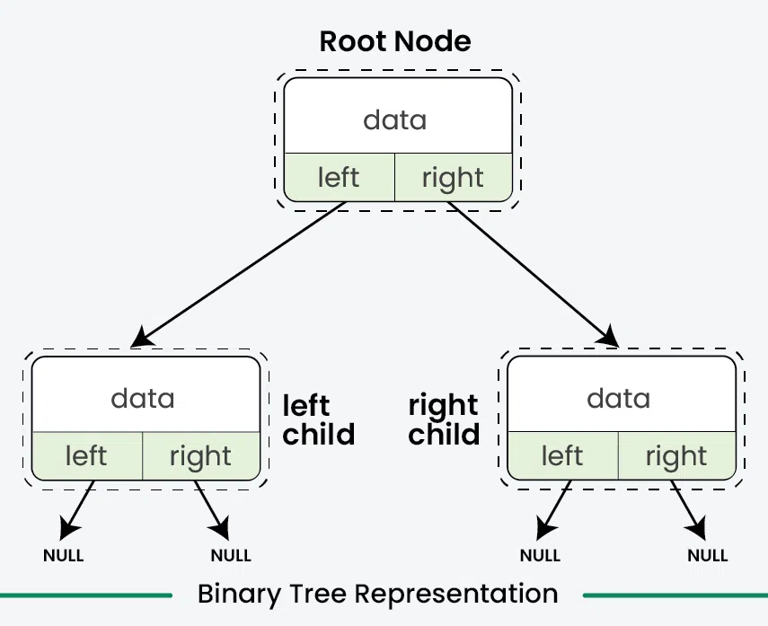

# [Binary Tree Data Structure](https://www.geeksforgeeks.org/binary-tree-data-structure/)
## What is it
- Hierarchical data structure
- Each node has **at most** two children
  - Commonly referred to as the `left` and `right` child 
- Commonly used for `efficient storage` and `retrieval of data` 
  - Along side various operations like
    - Insertion
    - Deletion
    - Traversal

# [Introduction](https://www.geeksforgeeks.org/introduction-to-binary-tree/)
## Binary Trees are 
- Non-linear 
- A hierarchical data structure that has at most `two children `
  - Commonly referred to as the `left` and `right` child 
- Top most binary tree is called `the root`
- Bottom most binary tree is called `the leaves` 


# Representation of a Binary Tree
- Each node has three parts
  - Data 
  - Pointer to the left child
  - Pointer to the right child



## Create/Declare a Node of a Binary Tree

```cpp
// Use any below method to implement Nodes of binary tree

// 1: Using struct
struct Node {
    int data;
    Node* left, * right;

    Node(int key) {
        data = key;
        left = nullptr;
        right = nullptr;
    }
};

// 2: Using class

// Node* is a self-referential class since it has pointers to other objects of the same type (Node)
// This is needed for DS list tree structures, linked lists and other recursive data structures
class Node {
public:
    int data;
    Node* left, * right;

    Node(int key) {
        data = key;
        left = nullptr;
        right = nullptr;
    }
};
```

## Example of Creating a Binary Tree


```cpp
#include <iostream>
using namespace std;

struct Node{
    int data;
    Node *left, *right;
    Node(int d){
        data = d;
        left = nullptr;
        right = nullptr;
    }
};

int main(){
    // Initilize and allocate memory for tree nodes
    Node* firstNode = new Node(2); // Parent node of 2 and 3
    Node* secondNode = new Node(3); // Parent node of 5
    Node* thirdNode = new Node(4); // No kids 
    Node* fourthNode = new Node(5); // Child of 3 and is still considered a leaf node since it doesn't have kids

    // Connect binary tree nodes
    firstNode->left = secondNode;   // 3
    firstNode->right = thirdNode;   // 4
    secondNode->left = fourthNode;  // 5
    return 0;
}
```

## In the code above 
- `Four tree nodes` were created and have connected those node to form the tree structure as mentioned in the above image 
  - `firstNode` that has the value `2`
  - `secondNode` that has the value `3`
    - Connected to the left of `firstNode` by `firstNode->left = secondNode`
  - `thirdNode` that has the value `4`
    - Connected to the `right` of `firstNode` by `firstNode->right = thirdNode`
  - `fourthNode` that has the value `5`
    - Connected to the left of `secondNode` by `secondNode->left = fourthNode`


## Binary Tree Terminology

| **Terminology** | **Definition** |
| --- | --- |
| Node | A fundamental part of a binary tree, containing data and links to two child nodes. |
| Root | The topmost node in a tree, with no parent and serving as the starting point for all nodes. |
| Parent Node | A node with one or more child nodes, having at most two children per node. |
| Child Node | A descendant of another node (its parent), having zero or more parents. |
| Leaf Node | A node without any children or both children being null. |
| Internal Node | A node with at least one child, excluding the root and leaf nodes. |
| Depth of a Node | The number of edges from a specific node to the root node, starting from zero. |
| Height of a Binary Tree | The number of nodes from the deepest leaf node to the root node, indicating the maximum depth of the tree. |

### Below shows all the terms in a Binary Tree


## Properties of a Binary Tree
- Max number of nodes at level `L` of a binary tree : 2<sup>L</sup>
- Max number of nodes in a binary tree of `HEIGHT`  : 2<sup>L</sup> - 1
- Total number of leaf nodes = Total number of nodes with 2 children + 1
  - Leaf nodes : Nodes that 
    - Don't have children
    - Or both children are full
- In a Binary Tree with N nodes 
  - Minimum possible height or the minimum number of levels is : Log<sub>2</sub>(N+1)
- A binary tree with `L` leaves 
  - Has at least : `| Log2L | + 1` levels 

## Types of Binary Tree(s)
### Based on the number of children
- Full  
- Degenerate  
- Skewed
### Based on the completion of levels
- Complete
- Perfect
- Balance 
### Based on the node values 
- Binary Search 
- AVL
- Red Black
- B 
- B+ 
- Segment 

## [Operations on a Binary Tree](https://www.geeksforgeeks.org/introduction-to-binary-tree/)
### Traversal in a Binary Tree
- Involves visiting `ALL the nodes` of the binary tree
- Tree traversal algorithms are classified broadly into two categories 
  - Depth-First Search (DFS)
  - Breadth-First Search (BFS)
---

### Depth-First Search 
- Explores far down a branch as possible `before backtracking`
- Implemented using `recursion`
- Main traversal methods in DFS are:
  - `Preorder Traversal `
    - Current-left-right
    - Visits node first 
    - Then left subtree
    - Then right subtree
  - `Inorder Traversal `
    - Left-current-right
    - Visits left subtree
    - Then node
    - Then right subtree
  - `Postorder Traversal`
    - Left-right-current
    - Visits left subtree
    - Then right subtree
    - Then the node

# Pre-Order Traversal Algorithm
### NLR Approach (Node → Left → Right)

Here's how the pre-order traversal algorithm works:
```bash
      2
     / \
    3   4
   /
  5
```
## Steps

1.  **Visit the root first**: Begin by visiting the root node of the binary tree.
    *   The root node is `2`.

2.  **Move to the left subtree**: Next, move to its left child.

3.  **Move further left (if necessary)**: If the left child has left children, move down one level and visit those nodes first.

4.  **Go back up and move to the right subtree**: Once all left descendants of a node have been visited, backtrack up the tree until you      
reach the previous parent node (the one whose left child you just visited), then proceed to its right subtree.

## Pre-Order Output

The pre-order traversal algorithm visits nodes in this order: `Node → Left → Right`.

For our binary tree:
```bash
      2
     / \
    3   4
   /
  5
```

*   Root Node: `2`
    *   Left Child of `2`: --> `3`
        *   Left Child of `3`: --> `5`
    *   Right Child of `2`: --> `4`

The pre-order traversal output is: `2 3 5 4`.

### Step-by-Step Pre-Order Traversal

Here's the step-by-step process:
For our binary tree:
```bash
      2
     / \
    3   4
   /
  5
```
1.  **Visit 2 (root)**
2.  **Move left → Visit 3**
    *   Move left again to visit `5` (since `3` has a left child)
3.  **No more left nodes, move back up to 2 and go right → Visit 4**
---

# Inorder Traversal Example : Left → Node → Right Approach
Take the following binary tree
```bash
      2
     / \
    3   4
   /
  5
```

#### Here's how the in-order traversal algorithm works:

1.  **Start at the root**: Begin by visiting the root node of the binary tree.
    *   The root node is `2`.

2.  **Move to the left subtree**: Before visiting the root, move to its left child.

3.  **Visit the leftmost node**: If there's a left child, move down one level and visit that node first.

4.  **Backtracking**: After visiting the leftmost node, backtrack up the tree until you reach the previous parent node (the one whose left child you just visited).

5.  **Visit the current node**: Then, move back to the current parent node (which is now at a lower level) and visit it.

6.  **Repeat steps 3-5 for all children**: Continue this process until all nodes in the tree have been visited.

#### Here's how this applies to our specific binary tree:
```bash
      2
     / \
    3   4
   /
  5
```

1.  Start at the root node `2`.
    *   Move to its left child, which is `3`.

2.  Visit `3`'s left child, which is `5`.
    *   Since `5` has no left child, print `5`.
    *   Backtrack up to `3`.
    *   Print `3`.

3.  Now backtrack up to the root node `2`.
4.  Move to the right subtree of the root node.
    *   Visit the right child of `2`, which is `4`.
    *   Since `4` has no left child, print `4`.

---

# Post-Order Traversal Algorithm
### LRN Approach (Left → Right → Node)

Here's how the post-order traversal algorithm works:

## Steps
```bash
      2
     / \
    3   4
   /
  5
```
1.  **Go to the left subtree first**: Begin by visiting the leftmost nodes of all child subtrees.
    *   The left subtree is `3`.
2.  **Move further left (if necessary)**: If the current node has a left child, move down one level and visit that child first.

3.  **Visit the current node (after its left children are visited)**: Once all left descendants of a node have been visited, backtrack        
up the tree until you reach the previous parent node (the one whose left child you just visited), then proceed to its right subtree.

4.  **Finally, visit the root**: After all leaf nodes and their descendants have been visited, move back up the tree and visit the
current node (in this case, the root).

## Post-Order Output

The post-order traversal algorithm visits nodes in this order: `Left → Right → Node`.

For our binary tree:
```bash
      2
     / \
    3   4
   /
  5
```

*   Root Node: `2`
    *   Left Child of `2`: `3`
        *   Left Child of `3`: `5`
    *   Right Child of `2`: `4`

The post-order traversal output is: `5 3 4 2`.

### Step-by-Step Post-Order Traversal

Here's the step-by-step process:
```bash
      2
     / \
    3   4
   /
  5
```
1.  **Move left → Move left again → Visit 5** (no children)
    *   Since there are no more left nodes, move back up to `3`.
2.  **Go back up to 3 → Visit 3**
    *   Now that all left descendants of `3` have been visited, proceed to its right child.
3.  **Move back up to 2 → Move right → Visit 4** (since `3` has no more children)
4.  **Visit 2 (root last)**


--- 

# Breadth-First Search
- Explores all nodes at the present level before moving on to nodes `at the next depth level`
- Typically implemented using a `queue`
- BFS commonly reffered to as `Level Order Traversal`

#### Example of traversal algorithm found below 

```cpp
#include <bits/stdc++.h>
using namespace std;

struct Node {
    int data;
    Node* left, * right;

    Node(int d) {
        data = d;
        left = nullptr;
        right = nullptr;
    }
};

// In-order DFS: Left, Root, Right
void inOrderDFS(Node* node) {
    if (node == nullptr) return;

    inOrderDFS(node->left);
    cout << node->data << " ";
    inOrderDFS(node->right);
}

// Pre-order DFS: Root, Left, Right
void preOrderDFS(Node* node) {
    if (node == nullptr) return;

    cout << node->data << " ";
    preOrderDFS(node->left);
    preOrderDFS(node->right);
}

// Post-order DFS: Left, Right, Root
void postOrderDFS(Node* node) {
    if (node == nullptr) return;

    postOrderDFS(node->left);
    postOrderDFS(node->right);
    cout << node->data << " ";
}

void BFS(Node* root) {

    if (root == nullptr) return;
    queue<Node*> q;
    q.push(root);
    
    //Queue stuff here
    while (!q.empty()) {
        Node* node = q.front();
        q.pop(); 
        cout << node->data << " ";
        if (node->left != nullptr) q.push(node->left);
        if (node->right != nullptr) q.push(node->right);
        
    }
}

int main() {
    Node* root = new Node(2);
    root->left = new Node(3);
    root->right = new Node(4);
    root->left->left = new Node(5);

    cout << "In-order DFS: ";
    inOrderDFS(root);

    cout << "\nPre-order DFS: ";
    preOrderDFS(root);
   
    cout << "\nPost-order DFS: ";
    postOrderDFS(root);
  
    cout << "\nLevel order: ";
    BFS(root);

    return 0;
}
```
---

## Insertion in Binary Tree
- How to add new nodes into binary tree
- FYI, there is no ordering of nodes in a binary tree

### First step
- Create a `root node` for an empty tree
- The following insertuions would iteratively search for an `empty place` at each level of the tree 
  - When an empty `left` or `right` child is found 
  - A new node is inserted there 
  - By convention insertion always starts with the left child node


### Example code 
```cpp
#include <bits/stdc++.h>
using namespace std;

struct Node {
    int data;
    Node* left, * right;
    Node(int d) {
        data = d;
        left = right = nullptr;
    }
};

// Function to insert a new node in the binary tree
Node* insert(Node* root, int key) {
    // If the tree is empty, create the root node
    if (root == nullptr) {
        root = new Node(key);
        return root;
    }
    // Create a queue for level order traversal
    queue<Node*> q;
    q.push(root);

    // Do level order traversal until we find an empty place
    while (!q.empty()) {
        Node* temp = q.front();
        q.pop();

        // If left child is empty, insert the new node here
        if (temp->left == nullptr) {
            temp->left = new Node(key);
            break;
        } else {
            q.push(temp->left);
        }
        // If right child is empty, insert the new node here
        if (temp->right == nullptr) {
            temp->right = new Node(key);
            break;
        } else {
            q.push(temp->right);
        }
    }
    return root;
}

void inorder(Node* root) {
    if (root == nullptr) return;
    inorder(root->left);
    cout << root->data << " ";
    inorder(root->right);
}

int main() {
    Node* root = new Node(2);
    root->left = new Node(3);
    root->right = new Node(4) ; 
    root->left->left = new Node(5);
  
    cout << "Inorder traversal before insertion: ";
    inorder(root);
    cout << endl;

    int key = 6;
    root = insert(root, key);

    cout << "Inorder traversal after insertion: ";
    inorder(root);
    cout << endl;

    return 0;
}

```