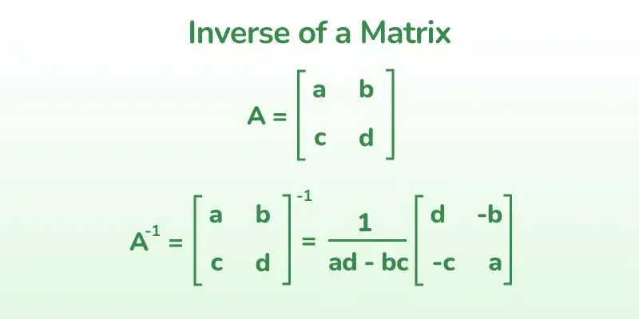

# [Adjoint and Inverse of a Matrix](https://www.geeksforgeeks.org/adjoint-inverse-matrix/)

## Inverse of a matrix
### What is it
- The inverse matrix can be denoted as \( A^{-1} \)
- The inverse matrix is a matrix when multiplied by `A` results in the `identity matrix`
$$
A * A^{-1} = A^{-1} * A = Identity Matrix
$$
- Not all matricies have an inverse 
  - Must be a square 
  - And the determinate `must not be zero` to have an inverse 
    
    ### To calculate a \(2 \times 2\) matrix determinate :
    Given a matrix \(\begin{pmatrix} a & b \\ c & d \end{pmatrix}\), the determinant is calculated as:
    \[
    \text{det} = ad - bc
    \]

    ### To calculate a a \(3 \times 3\) matrix determinate:
    Given a matrix \(\begin{pmatrix} a & b & c \\ d & e & f \\ g & h & i \end{pmatrix}\), the determinant is calculated using the formula:
    \[
    \text{det} = a(ei - fh) - b(di - fg) + c(dh - eg)
    \]

    This can also be written as:
    \[
    \text{det} = a(ei - fh) - b(di - fg) + c(dh - eg)
    \]

## How to calculate the inverse 
- adj A = adjoint of the matrix A
  - Aka : the transpose of a cofactor matrix of that particular matrix
\[
A^{-1} = \frac{1}{|A|} \cdot \text{Adj}(A)
\]

## To find the inverse of a matrix 
1) Determine the minors of all A elements
2) Next, compute the cofactors of all elements and build the cofactor matrix by substituting the elements of A with their respective cofactors.
3)  Take the transpose of A’s cofactor matrix to find its adjoint (written as adj A).
4)  Multiply adj A by the reciprocal of the determinant of A.

# Finding the Inverse of a Matrix

To find the inverse of the matrix:

\[
A =
\begin{bmatrix}
4 & 3 & 8 \\
6 & 2 & 5 \\
1 & 5 & 9
\end{bmatrix}
\]

## follow these steps:

---

## Step 1: Check if the Matrix is Invertible

A matrix is invertible if its determinant is non-zero.

### Compute the Determinant of \( A \):
For a \( 3 \times 3 \) matrix:

\[
\text{det}(A) = a(ei - fh) - b(di - fg) + c(dh - eg),
\]

where:

\[
A =
\begin{bmatrix}
a & b & c \\
d & e & f \\
g & h & i
\end{bmatrix}.
\]

For \( A = \begin{bmatrix} 4 & 3 & 8 \\ 6 & 2 & 5 \\ 1 & 5 & 9 \end{bmatrix} \):

\[
a = 4, \, b = 3, \, c = 8, \, d = 6, \, e = 2, \, f = 5, \, g = 1, \, h = 5, \, i = 9.
\]

Substitute into the formula:

\[
\text{det}(A) = 4((2)(9) - (5)(5)) - 3((6)(9) - (5)(1)) + 8((6)(5) - (2)(1)).
\]

Simplify step-by-step:

\[
\text{det}(A) = 4(18 - 25) - 3(54 - 5) + 8(30 - 2),
\]
\[
\text{det}(A) = 4(-7) - 3(49) + 8(28),
\]
\[
\text{det}(A) = -28 - 147 + 224,
\]
\[
\text{det}(A) = 49.
\]

Since \( \text{det}(A) \neq 0 \), the matrix is invertible.

---

## Step 2: Find the Cofactor Matrix

The cofactor matrix is constructed by finding the cofactor of each element of \( A \).

\[
A =
\begin{bmatrix}
4 & 3 & 8 \\
6 & 2 & 5 \\
1 & 5 & 9
\end{bmatrix}
\]

### Cofactor Formula:
The cofactor of an element \( A_{ij} \) is:

\[
C_{ij} = (-1)^{i+j} \cdot \text{det}(M_{ij}),
\]

where \( M_{ij} \) is the minor matrix obtained by removing the \( i \)-th row and \( j \)-th column.

Remember :
- i = row 
- j = column
### Compute Cofactors for \( A \):
#### Row 1 Cofactors:
1. \( C_{11} \): Remove row 1 and column 1:

\[
A =
\begin{bmatrix}
4 & 3 & 8 \\
6 & 2 & 5 \\
1 & 5 & 9
\end{bmatrix}
\]  

\[
M_{11} =
\begin{bmatrix}
2 & 5 \\
5 & 9
\end{bmatrix}, \quad \text{det}(M_{11}) = (2)(9) - (5)(5) = 18 - 25 = -7.
\]
\[
C_{11} = (-1)^{1+1} \cdot (-7) = -7.
\]

2. \( C_{12} \): Remove row 1 and column 2:

\[
M_{12} =
\begin{bmatrix}
6 & 5 \\
1 & 9
\end{bmatrix}, \quad \text{det}(M_{12}) = (6)(9) - (5)(1) = 54 - 5 = 49.
\]
\[
C_{12} = (-1)^{1+2} \cdot (49) = -49.
\]

3. \( C_{13} \): Remove row 1 and column 3:

\[
M_{13} =
\begin{bmatrix}
6 & 2 \\
1 & 5
\end{bmatrix}, \quad \text{det}(M_{13}) = (6)(5) - (2)(1) = 30 - 2 = 28.
\]
\[
C_{13} = (-1)^{1+3} \cdot (28) = 28.
\]

#### Row 2 and Row 3 Cofactors:
Repeat the process for all elements. The cofactor matrix is:

\[
C =
\begin{bmatrix}
-7 & -49 & 28 \\
13 & 28 & -17 \\
-1 & 28 & -10
\end{bmatrix}.
\]

---

## Step 3: Transpose the Cofactor Matrix

The adjugate matrix \( \text{adj}(A) \) is the `transpose` of the cofactor matrix so just swap the columns for the rows:

\[
\text{adj}(A) =
\begin{bmatrix}
-7 & 13 & -1 \\
-49 & 28 & 28 \\
28 & -17 & -10
\end{bmatrix}.
\]

---

## Step 4: Compute the Inverse

The inverse is:

\[
A^{-1} = \frac{1}{\text{det}(A)} \cdot \text{adj}(A).
\]

Substitute \( \text{det}(A) = 49 \):

\[
A^{-1} = \frac{1}{49} \cdot
\begin{bmatrix}
-7 & 13 & -1 \\
-49 & 28 & 28 \\
28 & -17 & -10
\end{bmatrix}.
\]

Simplify by dividing each element by \( 49 \):

\[
A^{-1} =
\begin{bmatrix}
-\frac{1}{7} & \frac{13}{49} & -\frac{1}{49} \\
-1 & \frac{4}{7} & \frac{4}{7} \\
\frac{4}{7} & -\frac{17}{49} & -\frac{10}{49}
\end{bmatrix}.
\]

This is the inverse of \( A \).

---

# Another method of finding the inverse : The elementary method

We will find the inverse of the following \( 2 \times 2 \) matrix \( A \) using the elementary transformation method:

\[
A = 
\begin{bmatrix}
2 & 1 \\
3 & 4
\end{bmatrix}.
\]

## Step 1: Augment the Matrix with the Identity Matrix

Augment \( A \) with the identity matrix \( I \):

\[
[A \,|\, I] = 
\begin{bmatrix}
2 & 1 & 1 & 0 \\
3 & 4 & 0 & 1
\end{bmatrix}.
\]

## Step 2: Perform Row Operations to Transform \( A \) into \( I \)

We will use row operations to make the left side of the augmented matrix the identity matrix. 

The operations are applied to `both sides` of the augmented matrix.

### 1. Make the top-left element equal to 1  
Divide row 1 (\( R_1 \)) by 2:

\[
R_1 \rightarrow \frac{R_1}{2}.
\]

Updated matrix:

\[
\begin{bmatrix}
1 & \frac{1}{2} & \frac{1}{2} & 0 \\
3 & 4 & 0 & 1
\end{bmatrix}.
\]

### 2. Make the bottom-left element 0  
Subtract \( 3 \times R_1 \) from \( R_2 \):

\[
R_2 \rightarrow R_2 - 3 \cdot R_1.
\]

Updated matrix:

\[
\begin{bmatrix}
1 & \frac{1}{2} & \frac{1}{2} & 0 \\
0 & \frac{5}{2} & -\frac{3}{2} & 1
\end{bmatrix}.
\]

### 3. Make the bottom-right element equal to 1  
Divide \( R_2 \) by \( \frac{5}{2} \):

\[
    R_2 \rightarrow \frac{R_2}{\frac{5}{2}} = R_2 \cdot \frac{2}{5}.
\]

Updated matrix:

\[
    \begin{bmatrix}
    1 & \frac{1}{2} & \frac{1}{2} & 0 \\
    0 & 1 & -\frac{3}{5} & \frac{2}{5}
    \end{bmatrix}.
\]

### 4. Make the top-right element 0  
Subtract \( \frac{1}{2} \times R_2 \) from \( R_1 \):

\[
    R_1 \rightarrow R_1 - \frac{1}{2} \cdot R_2.
\]

Updated matrix:

\[
    \begin{bmatrix}
    1 & 0 & \frac{11}{10} & -\frac{1}{5} \\
    0 & 1 & -\frac{3}{5} & \frac{2}{5}
    \end{bmatrix}.
\]

## Step 3: Extract the Inverse Matrix

After transforming the left side of the augmented matrix into the identity matrix, the right side becomes the inverse of \( A \):

\[
    A^{-1} = 
    \begin{bmatrix}
    \frac{11}{10} & -\frac{1}{5} \\
    -\frac{3}{5} & \frac{2}{5}
    \end{bmatrix}.
\]

## Verify the Inverse

Multiply \( A \) and \( A^{-1} \):

\[
    A \cdot A^{-1} = 
    \begin{bmatrix}
    2 & 1 \\
    3 & 4
    \end{bmatrix}
    \cdot
    \begin{bmatrix}
    \frac{11}{10} & -\frac{1}{5} \\
    -\frac{3}{5} & \frac{2}{5}
    \end{bmatrix}.
\]

Perform the multiplication:

\[
    =
    \begin{bmatrix}
    2 \cdot \frac{11}{10} + 1 \cdot -\frac{3}{5} & 2 \cdot -\frac{1}{5} + 1 \cdot \frac{2}{5} \\
    3 \cdot \frac{11}{10} + 4 \cdot -\frac{3}{5} & 3 \cdot -\frac{1}{5} + 4 \cdot \frac{2}{5}
    \end{bmatrix}.
\]

Simplify:

\[
    =
    \begin{bmatrix}
    1 & 0 \\
    0 & 1
    \end{bmatrix}.
\]

This confirms the result. \( A^{-1} \) is correct!

# Adjoint of a matrix
## How to calculate it 
- Take the ``transpose`` of the cofactor matrix of a given square matrix
- Adjoint == Adjugate matrix 

### To calculate the cofactors of the matrix:

\[
A = \begin{bmatrix}
5 & -2 & 2 & 7 \\
1 & 0 & 0 & 3 \\
-3 & 1 & 5 & 0 \\
3 & -1 & -9 & 4
\end{bmatrix}
\]

We need to find the `minor` for each element in the matrix, and then apply a checkerboard sign pattern to calculate the cofactors.

---

### Step 1: Find the Minor of an Element

The minor of an element \( A_{ij} \) is the determinant of the matrix obtained by removing the \( i \)-th row and \( j \)-th column from \( A \). 

The cofactor is calculated by multiplying the minor by \( (-1)^{i+j} \), which applies the checkerboard pattern of signs.

Let's walk through the calculation for each element.

---

#### Minor and Cofactor for Each Element
\[
A = \begin{bmatrix}
5 & -2 & 2 & 7 \\
1 & 0 & 0 & 3 \\
-3 & 1 & 5 & 0 \\
3 & -1 & -9 & 4
\end{bmatrix}
\]

##### Cofactor of \( A_{11} = 5 \):

Remove row 1 and column 1:

\[
\text{Minor of } A_{11} = \begin{vmatrix}
0 & 0 & 3 \\
1 & 5 & 0 \\
-1 & -9 & 4
\end{vmatrix}
\]

Now, calculate the determinant of the \( 3 \times 3 \) matrix using the formula:

\[
\text{det}(A) = a(ei - fh) - b(di - fg) + c(dh - eg),
\]

where

\[
    \begin{bmatrix} 
    a & b & c \\
    d & e & f \\
    g & h & i 
    \end{bmatrix}
    =
    \begin{bmatrix} 
    0 & 0 & 3 \\
    1 & 5 & 0 \\
    -1 & -9 & 4 
    \end{bmatrix}
\]

Applying the formula:

\[
\text{det}(A) = 0 \cdot \left( 5 \cdot 4 - 0 \cdot (-9) \right) - 0 \cdot \left( 1 \cdot 4 - 0 \cdot (-1) \right) + 3 \cdot \left( 1 \cdot (-9) - 5 \cdot (-1) \right)
\]

Simplifying:

\[
= 0 \cdot (20) - 0 \cdot (4) + 3 \cdot (-9 + 5)
\]
\[
= 0 + 0 + 3 \cdot (-4)
\]
\[
= 3 \cdot (-4) = -12
\]

Now, multiply by \( (-1)^{1+1} = 1 \) to get the cofactor:

\[
\text{Cofactor of } A_{11} = -12
\]

---

##### Cofactor of \( A_{12} = -2 \):

Remove row 1 and column 2:

\[
\text{Minor of } A_{12} = \begin{vmatrix}
1 & 0 & 3 \\
-3 & 5 & 0 \\
3 & -9 & 4
\end{vmatrix}
\]

Now, calculate the determinant of the \( 3 \times 3 \) matrix using the formula:

\[
\text{det}(A) = a(ei - fh) - b(di - fg) + c(dh - eg),
\]

where

\[
    \begin{bmatrix} 
    a & b & c \\
    d & e & f \\
    g & h & i 
    \end{bmatrix}
    =
    \begin{bmatrix} 
    1 & 0 & 3 \\
    -3 & 5 & 0 \\
    3 & -9 & 4 
    \end{bmatrix}
\]

Applying the formula:

\[
\text{det}(A) = 1 \cdot \left( 5 \cdot 4 - 0 \cdot (-9) \right) - 0 \cdot \left( -3 \cdot 4 - 0 \cdot 3 \right) + 3 \cdot \left( -3 \cdot (-9) - 5 \cdot 3 \right)
\]

Simplifying:

\[
= 1 \cdot (20) - 0 \cdot (-12) + 3 \cdot (27 - 15)
\]
\[
= 20 + 0 + 3 \cdot (12)
\]
\[
= 20 + 36 = 56
\]

Now, multiply by \( (-1)^{1+2} = -1 \) to get the cofactor:

\[
\text{Cofactor of } A_{12} = -56
\]

---

##### Cofactor of \( A_{13} = 2 \):

Remove row 1 and column 3:

\[
\text{Minor of } A_{13} = \begin{vmatrix}
1 & 0 & 3 \\
-3 & 1 & 0 \\
3 & -1 & 4
\end{vmatrix}
\]

Now, calculate the determinant of the \( 3 \times 3 \) matrix using the formula:

\[
\text{det}(A) = a(ei - fh) - b(di - fg) + c(dh - eg),
\]

where

\[
    \begin{bmatrix} 
    a & b & c \\
    d & e & f \\
    g & h & i 
    \end{bmatrix}
    =
    \begin{bmatrix} 
    1 & 0 & 3 \\
    -3 & 1 & 0 \\
    3 & -1 & 4 
    \end{bmatrix}
\]

Applying the formula:

\[
\text{det}(A) = 1 \cdot \left( 1 \cdot 4 - 0 \right) - 0 \cdot \left( -3 \cdot 4 - 0 \cdot 3 \right) + 3 \cdot \left( -3 \cdot (-1) - 1 \cdot 3 \right)
\]

Simplifying:

\[
= 1 \cdot (4) - 0 + 3 \cdot (3 - 3)
\]
\[
= 4 + 0 = 4
\]

Now, multiply by \( (-1)^{1+3} = 1 \) to get the cofactor:

\[
\text{Cofactor of } A_{13} = 4
\]

---

##### Cofactor of \( A_{14} = 7 \):

Remove row 1 and column 4:

\[
\text{Minor of } A_{14} = \begin{vmatrix}
1 & 0 & 0 \\
-3 & 1 & 5 \\
3 & -1 & -9
\end{vmatrix}
\]

Now, calculate the determinant of the \( 3 \times 3 \) matrix using the formula:

\[
\text{det}(A) = a(ei - fh) - b(di - fg) + c(dh - eg),
\]

where

\[
    \begin{bmatrix} 
    a & b & c \\
    d & e & f \\
    g & h & i 
    \end{bmatrix}
    =
    \begin{bmatrix} 
    1 & 0 & 0 \\
    -3 & 1 & 5 \\
    3 & -1 & -9 
    \end{bmatrix}
\]

Applying the formula:

\[
\text{det}(A) = 1 \cdot \left( 1 \cdot (-9) - 5 \cdot (-1) \right) - 0 + 0
\]
\[
= 1 \cdot (-9 + 5) = 1 \cdot (-4) = -4
\]

Now, multiply by \( (-1)^{1+4} = -1 \) to get the cofactor:

\[
\text{Cofactor of } A_{14} = 4
\]

---

### Summary of the Cofactors

- Cofactor of \( A_{11} = -12 \)
- Cofactor of \( A_{12} = -56 \)
- Cofactor of \( A_{13} = 4 \)
- Cofactor of \( A_{14} = 4
