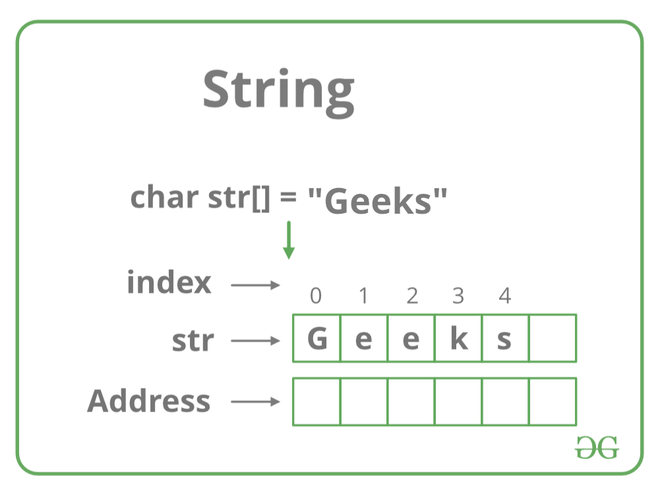

# [String Data Structures](https://www.geeksforgeeks.org/string-data-structure/?ref=shm#what-is-a-string)

## What exactly is a string
- A sequence of characters used to represent text
  - Represented as an array of bytes/words that store a sequence of chracters
- Commonly used to store/manipulate textual data 
  - Can be manipulated using various operations like
    - `Concatenation` 
    - `Substring extraction`
    - `Comparison` 
- Difference between `character array` and a `string`
  - `Strings` are terminated by special character `\0`

## String data type
- Treated as a `distinct data type`
  - Meaning they have their own set of `operations`/`properties` 
  - They can be declared/manipulated using specific string-related functions/methods 

## String operations
### The following operations let developers manipulate/process string data efficiently
- Concatenation: 
  - Combining two strings to create a new string.
- Length: 
  - Determining the number of characters in a string.
- Access: 
  - Accessing individual characters in a string by index.
- Substring: 
  - Extracting a portion of a string.
- Comparison: 
  - Comparing two strings to check for equality or order.
- Search: 
  - Finding the position of a specific substring within a string.
- Modification: 
  - Changing or replacing characters within a string.
- Compare
  - s1.compare(s2)
    - Determines which one is smaller
- Reverse
  - `reverse()`
- Sort
  - `sort()`

## Application of String
- Text processing
  - Use extensively for text processing tasks such as
    - Searching
    - Manipulating
    - Analyzing text data
- Data representation
  - Strings are fundamental for representing/manipulating data in formats like `JSON`, `XML` and `CSV`
- Encryption/Hashing
  - Strings commonly used in `encryption`/`hashing` algorithms to 
    - Secure sensitive data
    - Ensure data integrity 
- Database Opeartions 
  - Strings are esential when working with DB, to include `storing`/`querying` text-based data

## Advantages 
- Widely supported
  - Considered a fundamental data type in most programming languages 
- Efficient manipulation
  - Lots of algorithms and data structures have been written efficiently manipulate strings
  - Such as
    - String matching algorithms
    - String compression algorithms
    - Data structures such as   
      - Tries
      - Suffix arrays
- Ability to model real world data
  - Like names/addresses and other forms of text data
- Text mining/NLPs
  - Strings used as input to algorithms for text mining/NLPs such as
    - Sentiment analysis 
    - Named entity recognition 

## Disadvantages
- Encoding issues
  - Strings can be represented in different encodings such as `UTF-8` or `UTF-16`
  - Can cause compatibility issues when processing strings from different sources
- Immutable
  - Strings often implemented as immutable D.S 
  - Meaning that once a string is created `it can't be modified`
  - This can lead to additional overhead when it comes to manipulating strings 
    - Since new strings have to be created `for every modification`
- Security vulnerabilities
  - Strings are prone to `buffer overflows` or `injection attacks` if not handled properly
  - Since strings can be manipulated by the attacker to execute arbitary code or access sensitive data

# Basics of Strings

## [How are strings represented in memory](https://www.geeksforgeeks.org/introduction-to-strings-data-structure-and-algorithm-tutorials/)
- Strings can be referred to as either as :
  - Using a character pointer
  - Character array
    - When declared as such, they're stored like other types of arrays in C
    - Example : if `str[]` is a `auto variable` then the string is stored in the `stack segment`
    - If it's a `global/static variable` then the data is stored in the data segment

        

## General operations performed on String

### Concatenation of Strings
- Aka : combining more than one string together 
- Using [built in methods](https://www.geeksforgeeks.org/string-concatenation-in-cpp/)

#### 6 methods
- `append()`
- The `+` operator
- `strcat()` function
- Using a for loop [NOT DISCUSSED FURTHER IN MARKDOWN NOTES]
- Using inheritance [NOT DISCUSSED FURTHER IN MARKDOWN NOTES]
- Using `Friend Function` and `strcat()` function [NOT DISCUSSED FURTHER IN MARKDOWN NOTES]

### The `append()` function
- Member function of the std::string class
- Can concatenate two C++ style strings as shown in the example below

```cpp
// C++ Program for string
// concatenation using append
#include <iostream>
using namespace std;

// Driver code
int main()
{
	string init("this is init");
	string add(" added now");

	// Appending the string.
	init.append(add);

	cout << init << endl; // Output : this is init added now

	return 0;
}

```

### The `+` operator
- Easiest method to concatenate two strings 
- Only works with `C++ style` strings 
``` cpp
// C++ Program for string
// concatenation using '+' operator
#include <iostream>
using namespace std;

// Driver code
int main()
{
	string init("this is init");
	string add(" added now");

	// Appending the string.
	init = init + add;

	cout << init << endl;
	return 0;
}
```

### Using `strcat()`
- Built in function in `<string.h>`
- Only works for `C-style strings`
- Does NOT work for C++ style strings
  - Aka std::string objects
- Syntax : `char * strcat(char * init, const char * add);`

```cpp
// C++ Program for string
// concatenation using strcat
#include <iostream>
#include <string.h>
using namespace std;

// Driver code
int main()
{
	char init[] = "this is init";
	char add[] = " added now";

	// Concatenating the string.
	strcat(init, add);

	cout << init << endl;
  // this is init added now

	return 0;
}

```
### Not listing out other methods cause it doesn't seem worth the time

---

# [Iterate over characters of a string in C++](https://www.geeksforgeeks.org/iterate-over-characters-of-a-string-in-c/?ref=roadmap)

## Given string `str` of lenght `N` traverse and print all the characters of the given string

## Example 

```
Input: str = “GeeksforGeeks”
Output: G e e k s f o r G e e k s

Input: str = “Coder”
Output: C o d e r
```

### Basic AF approach 
- Use loop to iterate over the range `[0, N-1]`
```cpp
// C++ program to implement 
// the above approach 

#include <bits/stdc++.h> 
using namespace std; 

// Function to traverse the string and 
// print the characters of the string 
void TraverseString(string &str, int N) 
{ 
	// Traverse the string 
	for (int i = 0; i < N; i++) { 

		// Print current character 
		cout<< str[i]<< " "; 
	} 
	
} 

// Driver Code 
int main() 
{ 
	string str = "GeeksforGeeks"; 
	
	// Stores length of the string 
	int N = str.length(); 

	TraverseString(str, N); 
  // G e e k s f o r G e e k s
} 

```

### Using the `auto` keyword

```cpp
// C++ program to implement 
// the above approach 

#include <bits/stdc++.h> 
using namespace std; 

// Function to traverse the string and 
// print the elements of the string 
void TraverseString(string &str, int N) 
{ 
	// Traverse the string 
	for (auto &ch : str) { 

		// Print current character 
		cout<< ch<< " "; 
	} 
} 
// Driver Code 
int main() 
{ 
	string str = "GeeksforGeeks"; 

	// Stores length of the string 
	int N = str.length(); 

	TraverseString(str, N); 
} 

```

```cpp
// Side note about & in for loop
std::string str = "hello";

// Without &, creates a copy of each character
for (auto ch : str) {
    ch = toupper(ch); // Modifies the copy, not the original string
}
std::cout << str << std::endl; // Output: hello (no change)

// With &, operates on the original string
for (auto &ch : str) {
    ch = toupper(ch); // Modifies the original string
}
std::cout << str << std::endl; // Output: HELLO (modified string)
```

### Using a `iterator`

```cpp
// C++ program to implement 
// the above approach 

#include <bits/stdc++.h> 
using namespace std; 

// Function to traverse the string and 
// print the elements of the string 
void TraverseString(string &str, int N) 
{ 
	
	// Stores address of 
	// a character of str 
	string:: iterator it; 
	
	// Traverse the string 
	for (it = str.begin(); it != str.end(); 
								it++) { 
		// Print current character 
		cout<< *it<< " "; 
	} 
} 

// Driver Code 
int main() 
{ 
	string str = "GeeksforGeeks"; 
	
	
	// Stores length of the string 
	int N = str.length(); 
	TraverseString(str, N); 
  // G e e k s f o r G e e k s

} 

```

#### All three methods have the same time complexity and auxiliary space
##### Time complexity : 0(N)
##### Auxiliary space : 0(1)

---

# [Getting a substring in C](https://www.geeksforgeeks.org/get-a-substring-in-c/?ref=roadmap)

## Task : Given `str`, `pos`, and `len` that defines the starting and length of subarray. The objective is to generate a substring of size `len` starting from the index `pos`

```sh
# Example
Input: Str =”the”, pos=1, len=2
Output:  “th”
Explanation: substrings will be: “”, “t”, “h”, “e”, “th”, “he”, “the”.

Input: Str =”geeks”, pos=3, length=3
Output: “eks” 
Explanation: substrings are: “”, ” g”, “e”, “e”, “k”, “s”, “ge”, “ee”, “ek”, “ks”, “gee”, “eek”, “eks”, “geek”, “eeks”, “geeks”.
```

## How to solve the problem
- Create character array 
- Put characters starting from `pos` to the character array to generate the substring

## Example

```sh
Consider a string str=”abcde” , pos = 2, len = 3.

=> At i = 2 our ans = “c”. 

=> At i = 3, the character is ‘d’.
So add ‘d’ to the answer. 
Our ans = “cd”

=> At i = 4, the character is ‘e’.
So add ‘e’ to the answer.
Your ans = “cde”.
```

```cpp
// C implementation of code
#include <stdio.h>
#include <string.h>

// Function to get substr in C
void getString(int pos, int len, int i, char string[])
{
    char substring[1000];

    while (i < len) 
    {
        substring[i] = string[pos + i - 1];
        i++;
    }

    substring[i] = '\0';

    // Print the result
    printf(substring);
    printf("\n");
    return 0;
}

// Driver code
int main()
{

    int pos, len, i = 0;

    // Testcase1
    char string[14] = "geeksforgeeks";

    // Initialize pos, len i.e., starting
    // index and len up to which we have to
    // get substring respectively.
    pos = 6;
    len = 5;
    printf("String: %s ", string);
    printf("\nsubstring is: ");

    // Function call
    getString(pos, len, i, string);

    // Testcase2
    char string2[5] = "abcde";
    pos = 1;
    len = 3;
    i = 0;
    printf("\nString: %s ", string2);
    printf("\nsubstring is: ");

    // Function call
    getString(pos, len, i, string2);

    return 0;

    // String: geeksforgeeks 
    // substring is: forge

    // String: abcde 
    // substring is: abc
}

```

## Can also use `strncpy()` function in C
- To copy substring from given input string
- Takes 3 parameters : `char* strncpy( char* dest, const char* src, std::size_t count);`
  - Destination string
  - Source string
  - Starting index
  - Lenght of substring we need to copy

### Example
```cpp
// ------------------------ Basic String Copy ------------------------

#include <stdio.h>
#include <string.h>

int main() {
    char src[] = "Hello, World!";
    char dest[20];

    // Copy up to 19 characters from src to dest, ensuring dest is null-terminated
    strncpy(dest, src, sizeof(dest) - 1);

    // Manually add null terminator to the destination string
    dest[sizeof(dest) - 1] = '\0';

    // Print the source and destination strings
    printf("Source: %s\n", src);     // Expected Output: "Source: Hello, World!"
    printf("Destination: %s\n", dest); // Expected Output: "Destination: Hello, World!"

    return 0;
}

// ------------------------ Copying substring ------------------------
#include <stdio.h>
#include <string.h>

int main() {
    char src[] = "Hello, World!";
    char dest[6];

    // Copy only the first 5 characters from src to dest
    strncpy(dest, src, sizeof(dest) - 1);

    // Manually add null terminator to the destination string
    dest[sizeof(dest) - 1] = '\0';

    // Print the source and destination strings
    printf("Source: %s\n", src);       // Expected Output: "Source: Hello, World!"
    printf("Destination: %s\n", dest); // Expected Output: "Destination: Hello"

    return 0;
}


// ------------------------ Handling longer source strings ------------------------
#include <stdio.h>
#include <string.h>

int main() {
    char src[] = "This string is too long for dest!";
    char dest[10];

    // Copy only the first 9 characters from src to dest
    strncpy(dest, src, sizeof(dest) - 1);

    // Manually add null terminator to the destination string
    dest[sizeof(dest) - 1] = '\0';

    // Print the source and destination strings
    printf("Source: %s\n", src);       // Expected Output: "Source: This string is too long for dest!"
    printf("Destination: %s\n", dest); // Expected Output: "Destination: This stri"

    return 0;
}


```

---

# [Number of substrings of one string present in other](https://www.geeksforgeeks.org/number-of-substrings-of-one-string-present-in-other/?ref=roadmap)

## Lets say...
- We're given a string `S1`
- Need to find `total number of substrings`; to include `multiple occurences` of the same substring, of `s1` that's in `s2`

```sh
# Example
Input : s1 = aab
        s2 = aaaab
Output :6

Substrings of s1 are ["a", "a", "b", "aa", "ab", "aab"]. 

These all are present in s2.  

Hence, answer is 6.

Input :s1 = abcd
       s2 = swalencud
Output :3 
```

## The big idea
- Consider all substrings of `s1` and check if it's in `s2`

```cpp
// CPP program to count number of substrings of s1 
// present in s2.
#include<iostream>
#include<string>
using namespace std;

int countSubstrs(string s1, string s2)
{
	int ans = 0;

	for (int i = 0; i < s1.length(); i++) {
		
		// s3 stores all substrings of s1
		string s3;
		for (int j = i; j < s1.length(); j++) 
    {
      // Remember s1 = "aab"
      //          s2 = "aaaab"
			s3 += s1[j];

			// check the presence of s3 in s2
      // std::string::find() syntax : size_t find (const string& str, size_t pos = 0) const noexcept;
      // In this case since we're not passing a `pos`, it defaults to 0
			if (s2.find(s3) != string::npos) 
				ans++;
		}
	}
	return ans;
}

// Driver code
int main()
{
	string s1 = "aab", s2 = "aaaab";
	cout << countSubstrs(s1, s2); //6 
	return 0;
}

```

---

# [Find the count of palindromic sub-string of a string in its sorted form](https://www.geeksforgeeks.org/find-the-count-of-palindromic-sub-string-of-a-string-in-its-sorted-form/?ref=roadmap)

## Task
- Given `str` in lowercase
- Find total number of `palindromic sub-strings` present in the stored form of str

```sh
# Example 

Input: str = “acbbd” 
Output: 6 
All palindromic sub-string in it’s sorted form (“abbcd”) are “a”, “b”, “b”, “bb”, “c” and “d”.

Input: str = “abbabdbd” 
Output: 16 
```

## Solution
- Create `hash table` to store the `frequencies` of each character of the string `str`
- `Traverse the hash table` 
  - For each `non-zero` frequency add `(hash[i] * (hash[i]+1)) / 2` to the `sum`
- Print the `sum`

## What is a `hash table`
- Data structure that provides a way to `store/retrieve data` efficiently
- Uses `key-value` pairs
- Allows for fast data access 
  - Average time complexity of `O(1)` for search,insert, and delete operations

### How hash tables work
- `Keys and values`
  - Data stored in pairs
    - Each key associated with specific value
    - Example
      - To store a person's age 
        - Person's name could be the `key`
        - Their age could be the `value`
- `Hash function`
  - Used to convert the key `into an index`
  - Which determines the value associated with that `key` 
    - Should be stored in the underlying array of the hash table 
  - Goal of hash function
    - Distribute keys uniformly across table to `minimize collisions`
- `Collisions`
  - Happens when `two different keys` hash into the `same index`
  - Hash tables deal with collision in numerous ways
    - Like `chaining`
      - Each index in the array has a list of entries 
    - Or with using `open addressing`
      - Where the table searches for the next open spot

```cpp
// Hash table example
// Also check out FindPalindromicCount

#include <iostream>
#include <list>
#include <vector>
#include <string>

using namespace std;

class HashTable {
private:
    // The hash table will be a vector of lists
    // pair<string,int> --> holds two values, an int and a string
    // list<pair<string,int>> --> litterally a list where each element is a pair<string<int>>
    vector<list<pair<string, int>>> table;
    int numBuckets;  // Number of buckets in the table

    // Hash function to map a key to an index
    int hashFunction(const string &key) {
        int hash = 0;
        for (char ch : key) {
            hash = (hash * 31 + ch) % numBuckets; // A simple hash function
        }
        return hash;
    }

public:
    // Constructor to initialize the hash table with a given number of buckets
    HashTable(int size) {
        numBuckets = size;
        table.resize(numBuckets);
    }

    // Function to insert a key-value pair into the hash table
    void insert(const string &key, int value) {
        int index = hashFunction(key);
        // Check if the key already exists in the list
        for (auto &pair : table[index]) {
            if (pair.first == key) {
                pair.second = value; // Update the value if the key exists
                return;
            }
        }
        // If the key doesn't exist, add the new key-value pair
        table[index].emplace_back(key, value);
    }

    // Function to search for a value by its key
    int search(const string &key) {
        int index = hashFunction(key);
        for (auto &pair : table[index]) {
            if (pair.first == key) {
                return pair.second; // Return the value if found
            }
        }
        // Return -1 if the key is not found
        return -1;
    }

    // Function to delete a key-value pair from the hash table
    void remove(const string &key) {
        int index = hashFunction(key);
        table[index].remove_if([&key](const pair<string, int> &pair) {
            return pair.first == key;
        });
    }

    // Function to display the hash table (for debugging purposes)
    void display() {
        for (int i = 0; i < numBuckets; ++i) {
            cout << "Bucket " << i << ": ";
            for (auto &pair : table[i]) {
                cout << "{" << pair.first << ": " << pair.second << "} ";
            }
            cout << endl;
        }
    }
};

int main() {
    // Create a hash table with 7 buckets
    HashTable ht(7);

    // Insert some key-value pairs into the hash table
    ht.insert("apple", 3);
    ht.insert("banana", 5);
    ht.insert("orange", 7);
    ht.insert("grape", 9);

    // Display the hash table
    cout << "Initial Hash Table:" << endl;
    ht.display();

    // Search for a value
    string key = "banana";
    int value = ht.search(key);
    if (value != -1) {
        cout << "\nValue associated with key '" << key << "' is: " << value << endl;
    } else {
        cout << "\nKey '" << key << "' not found in the hash table." << endl;
    }

    // Delete a key-value pair
    ht.remove("orange");
    cout << "\nHash Table after deleting 'orange':" << endl;
    ht.display();

    return 0;
}

```


```cpp

// Geek for geek example to find palindrome
#include <bits/stdc++.h>
using namespace std;

const int MAX_CHAR = 26;

// function to return count of palindromic sub-string
int countPalindrome(string str)
{
    int n = str.size();
    int sum = 0;

    // initialize frequency table with 0
    int hashTable[MAX_CHAR] = {0};

    // calculate frequency
    for (int i = 0; i < n; i++)
        hashTable[str[i] - 'a']++;

    // calculate count of palindromic sub-string
    for (int i = 0; i < 26; i++) {
        if (hashTable[i])
            sum += (hashTable[i] * (hashTable[i] + 1) / 2);
    }

    // return result
    return sum;
}

// driver program
int main()
{
    string str = "ananananddd";

    cout << countPalindrome(str);
    return 0;
}

```